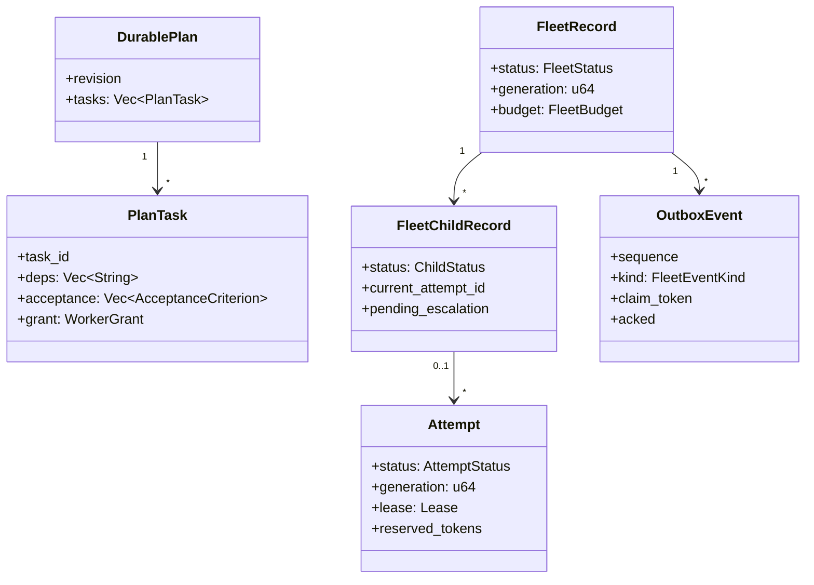
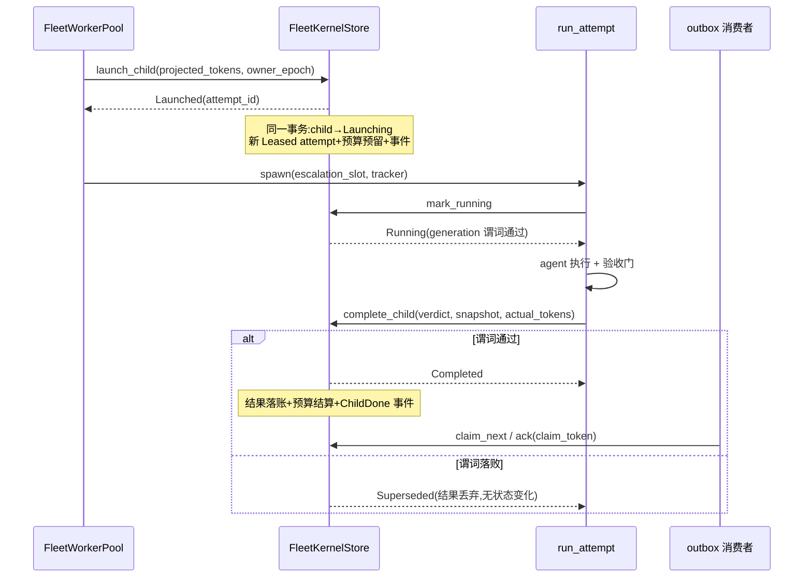
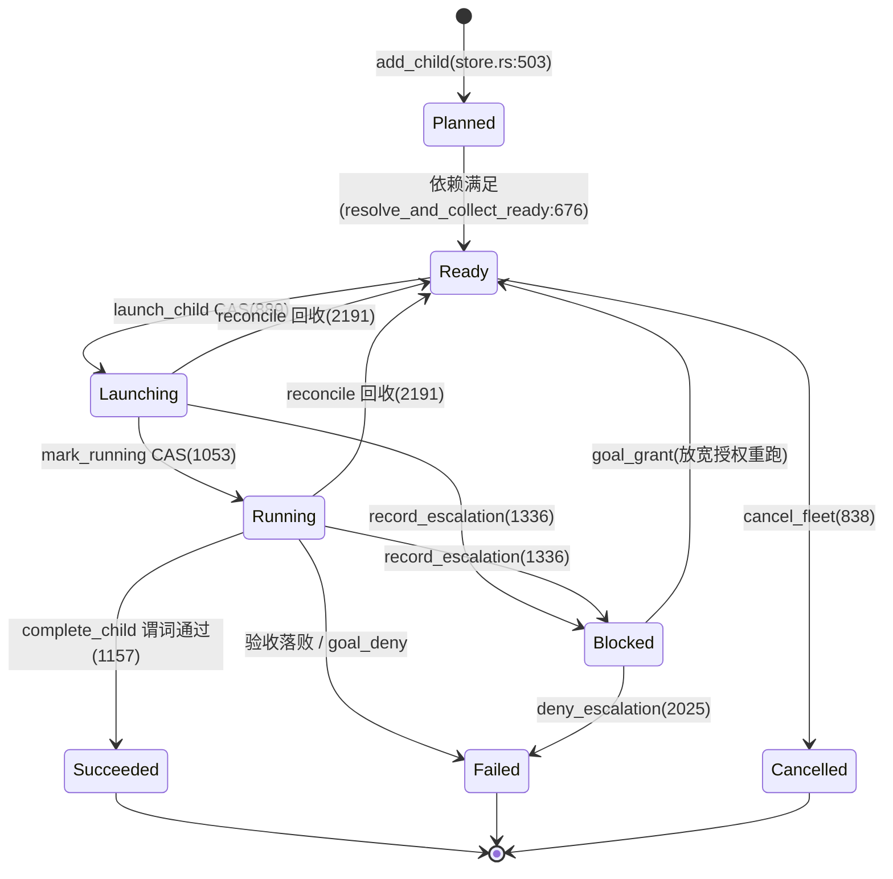

# 第 16 章:Fleet:可恢复的计划执行内核

> **定位**:本章分析 v2 新增的 fleet 内核:`crates/octos-fleet`(7 文件 16,888 行)与 `crates/octos-fleet-worker`(6 文件 6,842 行)如何用 redb 事务、attempt/lease/generation 状态机与持久 outbox,把一组长任务的执行进度从对话上下文搬进可恢复的存储。前置依赖:第 7 章(WorkerGrant 能力授予)、第 12 章(supervisor 事件账本与租约)。适用场景:要构建多 agent 编排运行时的开发者,以及关心「进程崩溃后接着跑」如何工程化的读者。

## 16.1 执行状态放在哪

第 18 章的 goal 功能把一个持久目标放进单个 agent 的对话里推进。对话会压缩,压缩有损,于是目标的执行状态(计划、决策、做完什么、还剩什么)随任务变长而流失。目标本身还挂在系统提示上,进度却在腐烂。这是 `docs/FLEET-RUNTIME-ADR.md`(176 行)开篇点名的失败模式:objective survives, progress rots。

写 ADR 时,仓库里已有三套互不知情的编排栈:peers 是持久的交互式会话,octos-swarm 是对外部一次性 agent 的批量派发,octos-pipeline 是 DOT 图工作流引擎(第 13 章)。如果直接把 goal 架在 peers 上,会出现第四套不兼容的账本、预算、重试与生命周期模型。ADR 的决定是先造一个共用的持久内核:子任务状态账本、预算预留、状态机、验收门都在内核里,批量、DAG、动态编队三种拓扑作为内核之上的规划器存在;worker 分两种,一次性任务 worker 先落地,可停靠的会话 worker 留给后续阶段。内核的实现就是本章的两个 crate,规格书是 `docs/FLEET-KERNEL-V1-SPEC.md`(347 行)与 `docs/FLEET-KERNEL-FOUNDATION-SPEC.md`(219 行)。

「执行状态腐烂」不是抽象担忧,可以落到具体物件上。goal 的计划是一份任务列表,决策是若干条带理由的判断,进度是「哪个任务到哪一步」。这三样东西如果只存在于对话历史里,一次压缩就可能丢失中间任务的结论,重试时 agent 只能凭摘要猜。内核把它们物化成 redb 里的行:计划是 `plans` 表的 `DurablePlan`,决策是 `decision_log` 表的追加条目,进度是 child 与 attempt 的状态字段。对话可以随便压缩,行不会;重试不需要猜,读表就行。这是「可恢复」三个字在数据层的全部含义,后面三节讲的是如何让这些行在并发与崩溃下仍然自洽。

两个 crate 的体量与分工:

| crate | 文件 | 行数 | 职责 |
|---|---|---|---|
| octos-fleet | 7 | 16,888 | 持久事务内核:记录、CAS 状态转移、预算、outbox、恢复 |
| octos-fleet-worker | 6 | 6,842 | 执行半边:封闭工具注册表、单次 attempt 执行器、有界池、escalate 阀 |

`crates/octos-fleet/src/lib.rs` 的模块文档给了一条硬边界:这个 crate 只依赖 redb、serde、tokio、uuid、eyre 与 octos-core,零 LLM 依赖、零 octos-agent 依赖,所有行为都能对着 tempdir 里的 redb 做单元测试。执行侧的依赖复杂性被整体推给了 worker crate。

本章沿三条支柱展开:记录模型(16.2)、事务与 outbox(16.3)、状态机与恢复(16.4),然后看 worker 侧的装配与执行(16.5、16.6),最后交代 `Fleet` 表层与相邻章的边界。

## 16.2 记录模型:一切先落盘

内核的世界由六张 redb 表构成,全部定义在 `crates/octos-fleet/src/store.rs:48-53`:`fleets`(fleet 行)、`fleet_children`(子任务行)、`attempts`(尝试行)、`plans`(持久计划)、`decision_log`(追加式决策日志)、`outbox`(事件发件箱)。键都是字符串,值是 JSON。记录类型集中在 `records.rs`(808 行),关键锚点如下:

| 符号 | 行号 | 内容 |
|---|---|---|
| `SCHEMA_VERSION = 3` | records.rs:33 | 每行携带的版本号 |
| `FleetBudget` | records.rs:119 | `token_budget` / `tokens_reserved` / `tokens_committed` / `hard` |
| `FleetRecord` | records.rs:145 | fleet 行,含 `generation` 围栏与 keeper 唤醒元数据(:152) |
| `Lease` | records.rs:250 | `owner_epoch` + `expires_at_ms` |
| `Attempt` | records.rs:256 | 尝试行,含 `generation` 与 `lease` |
| `DurablePlan` | records.rs:313 | 计划,内含 `PlanTask`:333、`AcceptanceCriterion`:356、`Verifier`:367、`EvidenceRef`:378 |
| `OutboxEvent` | records.rs:524 | 持久事件,`FleetEventKind`:545 |

计划任务是全模型的重点。`PlanTask` 不只有标题与依赖,还带 `acceptance` 验收条件列表与逐任务的 `grant`(worker 级能力授予,`#[serde(default)]` 使旧行缺省为最小授权)。验收条件由 `Verifier` 定义,目前四种:`Manual`、`FileExists`、`CommandExit`、`ValidatorRef`。完成的定义是数据加校验器,不是布尔值。`EvidenceRef` 把证据内容寻址(`sha256`),验收断言与实际观察到的内容无法漂移。



**图 16-1:记录模型。** 计划描述意图,child 与 attempt 记录执行,budget 与 generation 挂在 fleet 行上,outbox 承担对外通知。

版本迁移的策略值得单说。每行持久化数据都带 `schema_version`,加载时只丢弃版本更高的行(records.rs:571 的高版本守卫),旧二进制遇到新行是「不认识就丢」,永远不会错解析。`SCHEMA_VERSION` 从 2 升到 3 的原因写在 records.rs:25 的注释里:PR B 给 `ChildStatus` 增加了 `Blocked` 变体。加字段可以用 `#[serde(default)]` 向前兼容,不算升级;加枚举变体是破坏性变更,旧二进制解码 `"Blocked"` 会报未知变体错误而不是优雅跳过,所以必须升版本号,让旧二进制把这样的行按高版本丢弃。

这个判据值得展开,因为它是所有持久化 schema 的通用问题。字段新增是「行变宽」:旧代码读不到新键,serde 用默认值补上,数据仍在,只是新功能不可见。枚举变体新增是「值域变宽」:旧代码的 match 没有那个分支,反序列化直接失败,而且失败发生在整行解码时,一行坏会拖垮一次扫描。octos 的选择是把失败的粒度收进行级:版本守卫在完整解码前只探测 `schema_version`(records.rs 的 VersionProbe 结构),高版本行按 `Ok(None)` 丢弃,扫描继续。代价是丢数据,但丢的是「新二进制才理解的行」,旧二进制本来也无法正确处理它们,丢弃与失明等价,好过失明装作看见。

## 16.3 事务与 outbox:一次转移一个写事务

`FleetKernelStore`(store.rs:195)是事务原语层。模块文档(store.rs:6-8)给出每个方法的固定形状:一个 `begin_write` 内完成读当前行、检查 CAS 谓词、写下一态,预算结算与 outbox 追加也在同一个事务里,不存在跨存储的窗口。CAS 分区从 store.rs:880 的注释块开始,三个核心转移:

`launch_child`(store.rs:889)启动一个 Ready 子任务。谓词有四道:child 必须 Ready、无在飞 attempt、fleet 非终态(#1973 修复轮加入的终态围栏)、预算放行。全部通过后,一个事务写入 child 的 `Launching`、新的 `Leased` attempt(`AttemptStatus::Leased` 在 store.rs:997,`Lease{owner_epoch}` 在 :998)、预算预留与一条 `ChildLaunching` outbox 事件。任何拒绝都不留半状态:预算拒绝的 child 仍是 Ready,不会被晾在 Launching。

`mark_running`(store.rs:1053)把 Leased 推到 Running,四段谓词含 `attempt.generation == fleet.generation`(store.rs:1122)。`complete_child`(store.rs:1157)要求 child 处于 Running、generation 相等(:1236)、`lease.owner_epoch` 匹配(:1237),成功才写结果并结算预算。generation 是 fleet 行上的成员纪元,replan 时递增;旧世代的迟到事件被围栏拦下。

CAS 拒绝被建模为值,不是错误。`LaunchOutcome` / `CompleteOutcome` / `MarkRunningOutcome` 的 `Superseded` 变体(store.rs:59、75、102)是普通控制流,调用方据此推理;`Err` 只留给真实的基础设施故障。这个区分在 worker 侧有直接后果,16.6 会看到。

预算在事务内结算,`FleetBudget::admits`(records.rs:132)用 checked 加法求和再比较:

```rust
pub fn admits(&self, projected: u64) -> bool {
    match self
        .tokens_reserved
        .checked_add(self.tokens_committed)
        .and_then(|s| s.checked_add(projected))
    {
        Some(total) => total <= self.token_budget,
        None => false,
    }
}
```

溢出的和不可能是合法预算,直接拒绝;饱和算术会把 `MAX + MAX + 1 <= MAX` 静默判为放行(P2-5 修复)。v1 的 `hard = false` 是软准入:拒绝的是下一次启动,不打断在飞运行。

outbox 解决「状态变了要通知谁」。`append_event`(store.rs:2518)在各转移自己的写事务内追加(store.rs:2806 注释),事件类型四种:`ChildLaunching`、`ChildRunning`、`ChildDone`、`FleetDrained`。消费协议是真实的 claim/ack:`claim_next`(store.rs:2547)领取最低序号未确认事件,盖 `claimed_by`、新铸 `claim_token`、设 `claim_expires_at`;`ack`(store.rs:2603)必须出示匹配的 `(claimed_by, claim_token)`,不匹配返回 `StaleClaim`。这个令牌围栏(P1-3)挡住一种具体竞态:消费者的租约已过期、事件已被别人重领,旧消费者迟到的 ack 不会污染新消费者的进度。消费侧是 `crates/octos-cli/src/autonomy/fleet_wake.rs`(1,807 行)的 outbox 消费循环,它把 `ChildDone` / `FleetDrained` 变成 keeper 的续跑唤醒,且只在唤醒持久化后才 ack;未持久化的唤醒留在 claimed 状态,租约到期后自动重投。这套唤醒骑的是第 12 章的 MasterContinuationScheduler,调度细节详见第 12 章,keeper 语义详见第 18 章。

一次 attempt 从启动到落账的完整时序:



**图 16-2:一次 attempt 的时序。** 每个矩形注释都是单个写事务;CAS 落败走值返回,不走错误通道。

取消读侧的隐患靠 `io_gate` 处理:所有操作(含决策读取与扫描)先取 gate 的 owned guard,再把 guard 移进 `spawn_blocking` 闭包。被取消的调用者的不可中断阻塞写,不会乱序落在后续读取之后(spec v1.1 的修正)。

> ### 工程决策侧栏:为什么用 redb 事务,而不是内存状态加日志
>
> 备选方案是进程内维护状态机、把变更写日志,重启时重放。它有三个缺口。其一,「读、判定、写」三步在内存里天然分离,判定与写入之间可能插入崩溃,重放后的状态与判定时的假设不一致,要么给每个转移写补偿逻辑,要么接受脏状态。其二,预算结算是读改写,内存方案需要自己的锁协议,锁协议本身要被崩溃测试覆盖。其三,多表一致性(fleet 行、child 行、attempt 行、outbox)没有原生答案,要引入两阶段提交或接受窗口。redb 的单写事务把这三个缺口一起关掉:一次 `begin_write` 内的全部写入要么都可见要么都不见,崩溃恢复交给存储引擎。代价是所有访问串行化,这对 fleet 内核不构成瓶颈,它的写频率由任务生命周期决定,不在热路径上。`docs/FLEET-KERNEL-V1-SPEC.md` 把这套形状称为 one-write-transaction CAS,并列明它是从 octos-swarm 的 redb 持久层逐字抬升的。

## 16.4 状态机与恢复协调

三层状态各管一段:fleet 整体是 `FleetStatus`(Active / Draining / Complete / Failed,records.rs:41);子任务是 `ChildStatus`(Planned / Ready / Launching / Running / Blocked / Succeeded / Failed / Cancelled,records.rs:64);尝试是 `AttemptStatus`(Leased / Running / Done / Interrupted,records.rs:94)。`Blocked` 是 PR B 加入的非终态:attempt 让位去请求更宽的授权,等 keeper 决断(16.5)。



**图 16-3:child 状态机。** 每条边都落在 store.rs 的一个 CAS 方法上;reconcile 的回收边只在租约过期或外来纪元时触发。

恢复协调是 `reconcile`(store.rs:2191,报告类型 `ReconcileReport` 在 :160)。启动时以当前 `owner_epoch` 与时钟扫描所有 Launching / Running 的 child:活 fleet 的 attempt 只在租约失效(外来 `owner_epoch` 或 `expires_at_ms` 已过)时回收;终态 fleet 的在飞 attempt 无条件结算(#1973 修复轮:此前 Cancelled 的 fleet 被整体跳过,attempt 与预算预留被永久钉死)。回收动作是一个事务三件事:attempt 记 `Interrupted`、从 fleet 预算释放该 attempt 的预留(`checked_sub`,下溢即账务不变量破坏,直接报错)、child 清空 `current_attempt_id`。活 fleet 的 child 回到 Ready 等待本次启动重发;终态 fleet 的 child 记 Cancelled,永不复活(P2-7)。旧 attempt 永远不复活,重跑一律开新 attempt。

计划修订走 revision CAS:`replan`(store.rs:1512)带 `expected_revision`,递增 revision 并把任务的声明依赖同步到 child 行的反规范化副本;`retitle_task`(:1804)与 `set_task_grant`(:1898)同型。决策日志(`append_decision`:2648、`list_decisions`:2697)按序号追加,`DecisionKind` 是内核发出的封闭集合,与 `Finding` 的开放 `kind` 字符串(records.rs:447,一条可证伪的声明,component 字段做聚类键,供 digest.rs 的有界摘要读取)形成对照:内核决策封闭,探索发现开放。

## 16.5 worker 装配:封闭注册表与常开安全阀

worker 侧的第一个模块回答「一个 worker 到底能用什么工具」。`closed_registry.rs`(705 行)的 `build_fleet_worker_registry`(:92)从空注册表出发,按 `WorkerGrant.sorted_tools()` 装配封闭工具集,`ALLOWED`(:43)直接引用 `octos_fleet::BASE_TOOLS`(grant.rs:27)。grant 外的工具在注册表里不存在,重放时装配结果一致。grant 的四个类型在 `grant.rs`:`NetworkGrant`(:76,None / Hosts / Full)、`FsGrant`(:127,Workspace / Host)、`WorkerGrant`(:151,network / tools / fs / write_paths / create_only)、`GrantError`(:359);`validate()` 在 :247。这些类型与第 7 章逐行一致,语义与校验规则详见第 7 章,本章只消费它的结论。

`crates/octos-fleet-worker/src/lib.rs` 的模块文档补了一条容易被误读的边界:封闭注册表是工具名的拒绝表,删掉的是停靠、扇出与网络工具;它本身不是网络或进程边界。幸存的 `shell` 在 Full 授权下仍能触网,仍能用 shell 内部后台化脱离子进程,字符串检查抓不住这些。真正的边界是沙箱及其进程组回收,所以 `AgentFactory::new` 要求显式传入沙箱工厂,不提供静默的空实现;传空实现会被 `tracing::warn!` 标记,生产必须给网络隔离沙箱。这条边界的要求写在 API 文档里,类型系统无法强制,是操作员责任。

第二个模块是 escalate 阀(`escalate.rs`,293 行)。封闭 worker 缺某个能力(一个主机、一个工具、文件系统访问)时不能自扩授权,也不能停靠等人:它调用 `escalate` 工具,把 `EscalationRequest`(请求的 grant 加理由)写进共享槽(`EscalationSlot`:34,`EscalateTool`:37)立即返回。turn 结束后 `run_attempt` 读槽,若有值则调 `record_escalation`(store.rs:1336,同样校验 generation :1409 与 lease :1410),child 进 `Blocked`,交 keeper 决断:`goal_grant` 把 child 拨回 Ready 用更宽授权重跑,`goal_deny` 经 `deny_escalation`(store.rs:2025)把 Blocked 推到 Failed。`deny_escalation` 的返回类型在同一次写事务里顺带算出 `fleet_un_completable`(:2094 附近的设计注释):fleet 是否已无法自动完成,直接从 deny 后的持久状态推导,keeper 不必再做一次可能被跳过的读。工具永远注册、不随 grant 门控:最小授权的 worker 也必须能喊出「我被卡住了」。请求是 advisory,keeper 可以批得比要的少。

## 16.6 run_attempt 与有界池

`worker.rs`(2,575 行)的 `run_attempt`(:177)执行一次 attempt,五个终态(`AttemptOutcome`:146):

```rust
pub enum AttemptOutcome {
    Completed { verdict: AcceptanceVerdict },
    Superseded,
    Aborted { reason: String },
    RecordError { reason: String },
    Escalated { request: EscalationRequest },
}
```

第一步就是 `mark_running`,两种落败分开处理:`Superseded` 说明 attempt 确实不是本次的,返回 `Aborted`,池解除守卫;`Err` 是基础设施故障,Launching 的 attempt 可能仍是本次的,返回 `RecordError`,守卫保持武装,交给 Drop 清理与恢复协调。这两条路径的区分(round-4 P1 修复)直接建立在 16.3 的「值与错误分离」上。执行体包在硬 `tokio::time::timeout` 里,AgentFactory 把每工具超时钳到 deadline,worker shell 每命令有硬上限,验收阶段也受剩余时间约束。worktree 模式(`WorktreeContext`:67)下交付物的定义是一个分支上的 commit,空分支算无交付。

`pool.rs`(2,186 行)的 `FleetWorkerPool`(:109)是有界启动器,配置在 `PoolConfig`(:58):全局并发、单 fleet 并发、deadline、`owner_epoch`、租约 TTL、预留 token、工作区根、keeper profile、后端是否支持 repo 写。`dispatch`(:233)对同一 (fleet, task) 持 preflight 锁,跨「活性检查、worktree 准备、launch、spawn」全程,两个并发 dispatch 同一 Ready 任务时,输家看到赢家的在飞 attempt,被 launch 的 double-launch 拒绝兜住。worktree 是条件路径:仅当授权同时满足 Host 文件系统与 Full 网络、fleet 在 git 仓库上、后端支持 `.git` 写,三条全真才在任务稳定分支上开真 worktree,断点续跑从死者的最后 commit 开始;任一为假走 scratch 目录兜底。全信任门槛的推理写在 dispatch 的注释里:Host 文件系统加受限网络的组合并非真隔离(全文件系统能桥接任何网络围栏),干脆要求全网络,让两种逃逸都失去意义。提交锚点:`eadee2ae`(#1875)引入 WorkerGrant,`8fc66202`(#1881)落地 worktree worker。

有界池的「界」由两把信号量把守,`global_sem` 是全进程的总量上限,`per_fleet` 的 HashMap 按需建每 fleet 的信号量,条目永不修剪(上限是任务数,不是运行数)。这个设计把并发控制的真相放进了池而非内核:store 的 CAS 只保证不重不漏,至于同时跑几个、每 fleet 跑几个,是宿主的策略选择,内核不预设。拿不到许可的 dispatch 在信号量上排队,不产生任何持久状态;真正进入执行才走 launch 的事务。反过来,重启后池是空的,所有许可自然可用,不存在「许可表也要恢复」的次生问题:许可是内存里的信号量,恢复由 reconcile 对着持久状态完成,两者职责不重叠。

## 16.7 Fleet 表层与边界

`fleet.rs`(3,062 行)的 `Fleet`(:190)在 store 之上组合 CAS 操作成整计划 API:`create`(:210)、`bind`(:300)、`view`(:324)、`ready_tasks`(:375)、`apply_edit`(:402)、`record_outcome`(:542)、`is_complete`(:583)、`summary`(:595)。它不改变 store 语义,是未来 keeper 与 `goal_get` / `goal_update` 工具编程的表层。`sqlite_ledger.rs`(6,360 行)的 `GoalLedger`(:13)是另一份持久账本,服务 goal keeper 的目标、任务、发现与升级记录,属于第 18 章的主题;fleet 内核的六张 redb 表与它分工,互不替代。swarm 的扇出拓扑详见第 17 章;supervisor 的事件账本与唤醒调度详见第 12 章;WorkerGrant 的完整权限模型详见第 7 章。

## 16.8 本章回顾

1. 一个内核承载三种拓扑:记录模型(六张表、`SCHEMA_VERSION = 3` 的高版本丢弃策略)、事务 CAS(`launch_child` / `mark_running` / `complete_child` 的谓词与值式拒绝)、恢复协调(`reconcile` 的租约回收与永不复活)三支柱,把执行进度从对话上下文搬进 redb。
2. CAS 拒绝是值不是错误:`Superseded` 是控制流,`Err` 只留给基础设施故障,worker 侧据此区分 Aborted 与 RecordError。
3. 预算与 outbox 都在转移的写事务内:预留、结算、事件追加无跨库窗口;claim/ack 用 `claim_token` 围栏挡住过期消费者的迟到确认。
4. worker 从空注册表按 grant 装配,重放一致;沙箱才是边界,注册表只是工具名拒绝表;escalate 常开,Blocked 等 keeper 决断。
5. 池有界且串行 preflight:同任务并发 dispatch 被锁与 double-launch 双重拦截;worktree 需要全信任三条件,否则 scratch 兜底。

---

## 延伸阅读

- redb:https://github.com/cberner/redb — fleet 内核的嵌入式 KV 存储,单写事务是本章 CAS 形状的地基
- `docs/FLEET-RUNTIME-ADR.md`(176 行)— 一个内核、两种 worker、三种拓扑的架构决策记录
- `docs/FLEET-KERNEL-V1-SPEC.md`(347 行)— one-write-transaction CAS 与 io_gate 取消安全的实现规格
- `docs/FLEET-KERNEL-FOUNDATION-SPEC.md`(219 行)— 内核的地基设计,ADR 之下的落地层

## 思考题

1. `SCHEMA_VERSION` 对加字段与加枚举变体采取不同策略。若要给 `AttemptStatus` 增加 `Paused` 变体,同时给 `Attempt` 加 `paused_by` 字段,哪些改动需要升版本,哪些用 `#[serde(default)]` 就够?给出旧二进制在新库上的行为推演。
2. `claim_token` 围栏挡住了过期消费者的迟到 ack。若消费者在 ack 前崩溃,事件如何重投?重投后的 `claimed_by` 与 token 如何变化,迟到的旧消费者 ack 会得到什么返回?
3. `reconcile` 对终态 fleet 的在飞 attempt 无条件结算,child 记 Cancelled 永不复活。若改为「终态 fleet 的 child 也回 Ready」,会在哪些路径上违反哪条不变量?
4. worktree 路径要求 Host 文件系统与 Full 网络同时满足。若要支持「网络隔离的 worktree worker」,注释里提到的 `.git` 停靠围栏要防什么攻击?为什么全文件系统能绕过网络围栏?
5. 预算 `hard = false` 只拒绝下一次启动。若改成硬预算(打断在飞运行),`complete_child` 的谓词与 `run_attempt` 的终态枚举各要加什么?

---

> **版本演化说明**
> 本章为 v2 新增章,分析基于 octos main @ `9c157101`(2026-09-03 采集复核)。两个 crate 均为新代码:`octos-fleet` 与 `octos-fleet-worker` 不存在于 v1 旧稿;`WorkerGrant` 随 `eadee2ae`(#1875)进入内核,worktree worker 随 `8fc66202`(#1881)落地。所有行号与行数来自事实表 `assets/ch16-facts.md` 或本次会话对源码的只读核对;fleet 状态机在此前章节中曾被第 12 章以「详见第 16 章」前向引用,本章即其落点。
