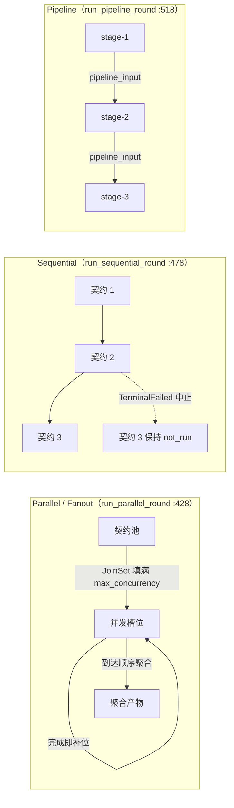
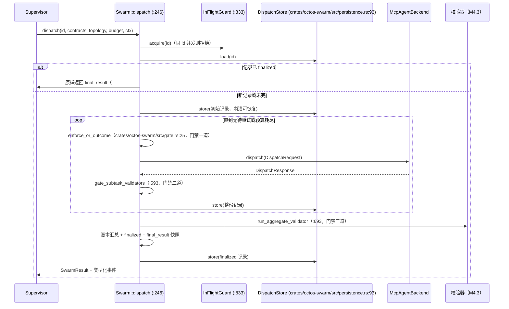
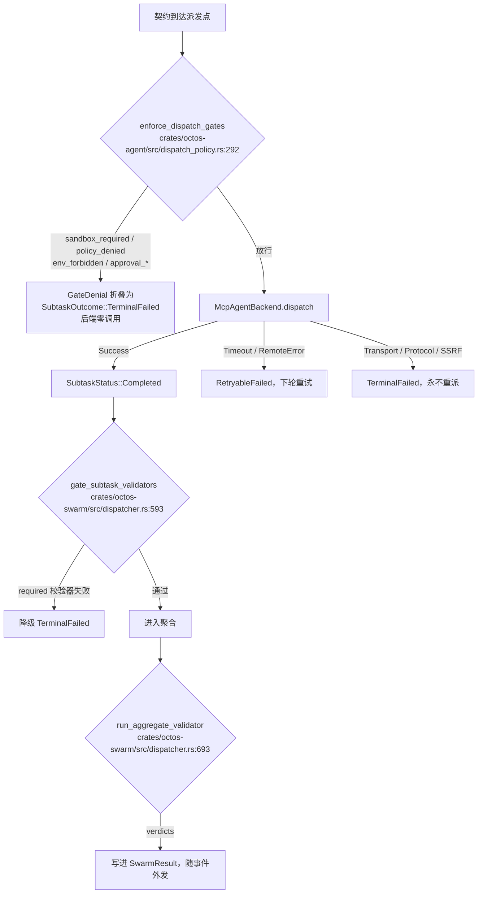

# 第 17 章：Swarm：契约扇出与聚合门禁

> **定位**：本章分析 `crates/octos-swarm` 如何把「supervisor 写 N 份契约、分发给外部 agent 后端、聚合产物、过校验门」收敛为一个可重入的编排原语：三种执行拓扑、三道门禁、一份幂等账本。前置依赖：第 10 章（校验器与事件 ABI）、第 16 章（Fleet）。适用场景：需要把一批子任务委派给外部 agent（如 claude、codex），并要求结果可信、成本可算、重放一致的开发者。

octos 的 harness 一直在跑一种手工模式：一个 PM 型 supervisor 把任务拆成 N 份，分发给若干 sub-agent，收回产物后人工比对、人工汇总、人工决定哪些要重跑。`octos-swarm` 的 crate 文档第一行写得很直白：`Swarm orchestration primitive for octos (harness M7.5)`（`crates/octos-swarm/src/lib.rs:1`），次行说明它把这套「PM + swarm supervisor」的手工模式形式化。手工模式的痛处在三处：分发不可控（谁拿到了哪份任务没有账）、产物不可信（sub-agent 说完成了就算完成）、重跑不一致（同一批任务第二次执行的边界和第一次不同）。这三处分别对应本章的三条主线：契约扇出、聚合门禁、幂等与恢复。

这个 crate 不大：7 个源文件 2,505 行，3 个集成测试文件 2,475 行，合计 4,980 行（事实表 `assets/ch17-facts.md` 对 main @ `9c157101` 的统计，统计日期 2026-09-03）。测试行数几乎与源码持平（1:0.99），36 个集成用例覆盖了拓扑、门禁、幂等、恢复四个面，这个比例本身就是本章反复出现的设计信号的预演：每一条不变量都有对应的名字和对应的测试。

| 文件 | 行数 | 职责 |
|---|---|---|
| crates/octos-swarm/src/dispatcher.rs | 1,261 | 编排核心：dispatch 循环、门禁、聚合、幂等 |
| crates/octos-swarm/src/result.rs | 395 | 类型化结果：SwarmResult / SubtaskOutcome / AggregateArtifact |
| crates/octos-swarm/src/persistence.rs | 275 | redb 持久化：DispatchStore 幂等账本 |
| crates/octos-swarm/src/topology.rs | 229 | 拓扑与契约：SwarmTopology / ContractSpec / FanoutPattern |
| crates/octos-swarm/src/ledger.rs | 115 | 成本账本适配（M7.5）：CostLedger trait + Noop 实现 |
| crates/octos-swarm/src/lib.rs | 111 | crate 门面与 re-export |
| crates/octos-swarm/src/gate.rs | 119 | 门禁粘合层：enforce_or_outcome |

## 17.1 契约：扇出的最小单位

Swarm 对「一次子任务」的全部理解收在一个结构体里。**契约**（`ContractSpec`，`crates/octos-swarm/src/topology.rs:37`）有四个字段：

```rust
pub struct ContractSpec {
    pub contract_id: String,
    pub tool_name: String,
    pub task: serde_json::Value,
    pub label: Option<String>,
}
```

`contract_id` 是重试去重与持久化的稳定键，调用方必须保证它在一次 dispatch 内唯一；`task` 对原语完全透明，逐字转发为 MCP `tools/call` 的参数；`label` 只给人看的运维界面，不参与关联。这个设计把「原语需要知道的」压缩到最小：身份、目标工具、负载，三样。契约里写什么、怎么验收，是 supervisor 与 sub-agent 之间的协议，原语不解释。

一次 dispatch 的契约总量有硬上限：`MAX_CONTRACTS_PER_DISPATCH: usize = 128`（`crates/octos-swarm/src/topology.rs:27`），在 `dispatch` 入口强制（`crates/octos-swarm/src/dispatcher.rs:246`）。上限防的是扇出模式的无界展开：`FanoutPattern`（`crates/octos-swarm/src/topology.rs:59`）把一份种子契约克隆成 N 份兄弟契约，`expand`（`crates/octos-swarm/src/topology.rs:72`）给每份的 `contract_id` 追加 `::variant` 后缀、往 `task` 里注入 `variant` 字段。原语不看 payload，只盖一个章，远端 agent 自己按 `variant` 切换行为。展开后的契约表由 `resolve_contracts`（`crates/octos-swarm/src/topology.rs:133`）统一产出：Fanout 拓扑用展开表覆盖种子表，其余拓扑原样保留。

## 17.2 编排三原语：Parallel、Sequential、Pipeline

`SwarmTopology`（`crates/octos-swarm/src/topology.rs:98`）有四个变体，但执行形状只有三种（`Parallel` 与 `Fanout` 共用扇出执行路径，区别只在契约表怎么来）。这三种就是编排三原语：扇出、顺序、流水线。

- **Parallel**：`run_parallel_round`（`crates/octos-swarm/src/dispatcher.rs:428`）用 `JoinSet` 把待重试的契约并发派发，先填满 `max_concurrency` 个槽位，每完成一个立刻补位。聚合按到达顺序。$n$ 份契约、并发度 $c$ 的总派发墙钟时间约等于 $\lceil n/c \rceil$ 乘单次后端往返，后端慢的时候并发度是唯一可调的杠杆。
- **Sequential**：`run_sequential_round`（`crates/octos-swarm/src/dispatcher.rs:478`）一次跑一个，首个硬失败（`TerminalFailed`）即中止，后续契约保持 `not_run`。适合有依赖顺序但产物不互相消费的批次，例如「先审事实表、再审草稿、最后审引用」这类前序失败即全盘无意义的链。
- **Pipeline**：`run_pipeline_round`（`crates/octos-swarm/src/dispatcher.rs:518`）把契约 i 的产物折叠进契约 i+1 的 `pipeline_input` 字段；前驱不是 `Completed` 就不派发后继。折叠的具体形状分两支（`crates/octos-swarm/src/dispatcher.rs:549-558`）：契约本身是 object task 时直接注入 `pipeline_input` 键；否则把 task 包成 `{"original_task": …, "pipeline_input": 前驱输出}` 的对象，前驱输出以字符串形态注入，远端 agent 按约定字段解读。



**图 17-1：三种执行拓扑。** Sequential 与 Pipeline 的并发度恒为 1（`max_concurrency`，`crates/octos-swarm/src/topology.rs:143`），它们的差异不在并发，在失败语义：Sequential 中止整批，Pipeline 只斩断链条并保留前段产物。

三种形状为什么这样切，而不是合并成一个带参数的执行器。Parallel 的设计压力在吞吐：后端往返是整批的瓶颈，槽位补位模型（完成一个补一个）让慢契约不阻塞快契约，代价是聚合顺序等于到达顺序，调用方如果需要稳定顺序就要自己在 `contract_id` 上重排。Sequential 的设计压力在浪费：当后序契约的输入蕴含前序结果（不是内容消费，而是「前序失败则后序必然无效」），并发只会生产一堆注定丢弃的产物，恒为 1 的并发度把浪费压到零，首个硬失败即中止把判定点提前到失败发生的那一刻。Pipeline 的设计压力在数据依赖：后继的输入字段就是前驱的输出，任何「后继带着空输入完成」的情况都是静默损坏，所以它的不变量最严：前驱不是 `Completed` 就不派发，宁可整轮空转也不冒污染链的风险。三个原语各绑定一条不变量（吞吐可调、失败即停、依赖即序），合并成一个参数化执行器会让这三条不变量变成互斥的配置组合，出错的配置就是静默损坏的配置。这也是 `SwarmTopology` 做成 enum 而不是 struct 的原因：调用方在类型层面就只能选一种形状，没有「Sequential 但并发 3」这种自相矛盾的组合。

Fanout 单独做成变体而不是调用方自己克隆契约表，理由在幂等：`::variant` 后缀的生成规则由原语控制，每份展开契约的 `contract_id` 稳定可复现，同一 pattern 两次展开得到同一组 id，重试与恢复才能对上 redb 里的行。调用方手写克隆一旦改了 id 格式，恢复路径就找不回旧状态。测试 `should_expand_fanout_pattern_into_variant_contracts`（`crates/octos-swarm/tests/swarm_dispatch.rs:707`）钉住展开规则。

Pipeline 的失败语义值得单独说。早期的实现里，若 stage-2 可重试失败，stage-3 会在同一轮被无输入派发，然后被记为 `Completed`，链条 静默断裂。修复（#1717，测试 `should_stop_pipeline_round_at_retryable_stage_and_resume_with_input`，`crates/octos-swarm/tests/swarm_dispatch.rs:763`，下文测试引用均省略 `crates/octos-swarm/tests/` 前缀）加了一条前置条件：一个 stage 只有在前驱 `Completed` 时才可能被派发，恢复轮同样适用。测试断言 stage-2 两次尝试都链接到 stage-1 的输出、stage-3 恰好运行一次且拿到恢复后的 stage-2 输出。

Sequential 的中止语义同样跨崩溃成立。`run_sequential_round` 在处理每个待重试槽位前，先扫一遍它之前的所有子任务：只要发现任何一个 `TerminalFailed`，整轮立即返回中止标记（`crates/octos-swarm/src/dispatcher.rs:478`）。这条检查表面看是多余的（中止时循环早就 break 了），但它守护的是恢复路径：一份带着硬失败标记的记录被重启后的新进程重新 dispatch，尾部的契约必须保持 `not_run`，不能因为「这轮刚开始」就被派发出去。测试 `should_not_resume_sequential_tail_after_persisted_terminal_failure`（`crates/octos-swarm/tests/swarm_dispatch.rs:1213`）与 Pipeline 版本（:1163）钉住了这个边界。

重试预算由 `SwarmBudget`（`crates/octos-swarm/src/dispatcher.rs:66`）控制，默认上限 `MAX_RETRY_ROUNDS: u32 = 3`（`crates/octos-swarm/src/dispatcher.rs:60`），且被钳在 3 以内：调用方给更大的值也会被压回。预算的消耗规则经过一次修正（#1717 的 review finding 5）：只有零进展的轮才消耗预算；完成过至少一个新契约的轮不计数，因为这类轮天然被契约总数约束，循环仍会终止。预算检查也从「轮后」改到「轮前」（review finding 2）：一条停在预算上限的记录被恢复时，一个轮都不派发，否则每次崩溃恢复都白送一轮，反复恢复就能绕过上限。

## 17.3 一次 dispatch 的完整时序

`Swarm::dispatch`（`crates/octos-swarm/src/dispatcher.rs:246`）接收五个参数：dispatch_id、契约表、拓扑、预算、上下文（`SwarmContext` 携带 session_id / task_id / workflow / phase，供事件路由）。构造走 `Swarm::builder`（`crates/octos-swarm/src/dispatcher.rs:206`）返回的 `SwarmBuilder`，可选挂载成本账本、聚合校验器、事件汇与 dispatch 策略，不挂则用 Noop 默认值。完整时序如下：



图 17-2：一次 dispatch 的时序。 每一步都能在 `crates/octos-swarm/src/dispatcher.rs` 与 `crates/octos-swarm/src/persistence.rs` 的具名方法里找到，并与 `crates/octos-swarm/tests/swarm_dispatch.rs` 的用例对应：入口幂等对应 `should_survive_process_restart_mid_dispatch`（:560），并发拒绝对应 `should_reject_concurrent_dispatch_with_same_id`（:1100），逐字重放对应 `should_replay_finalized_result_verbatim_including_validator_verdicts`（:821）。

每轮结束都把整份记录写回 redb，而不是攒到最后一次性写。代价是每轮一次序列化提交；收益是崩溃点任意移动，恢复都从最近的轮快照续跑。事件在 finalize 之后发出：`HarnessSwarmDispatchEvent` 带 `SWARM_DISPATCH_SCHEMA_VERSION`（固定为 1），失败结果的事件会把第一个未完成子任务的错误顶到 message 字段，supervisor 不必翻完整记录就能拿到可行动的线索。事件 ABI 与 schema 版本化的机制详见第 10 章。

## 17.4 后端抽象：MCP sub-agents 与 CLI 接线

分发目标是一个 trait：`McpAgentBackend`（`crates/octos-agent/src/tools/mcp_agent.rs:411`），核心方法 `dispatch(DispatchRequest) -> DispatchResponse`。请求（:266）携带工具名与契约 task；响应（:218）携带文本输出与 `files_to_send`；单次结果枚举 `DispatchOutcome`（:182）区分 Success、Timeout、TransportFailure 等类。Swarm 对后端结果的理解压缩在一个映射函数里（`SubtaskStatus::from_dispatch`，`crates/octos-swarm/src/result.rs:20`）：

```rust
pub fn from_dispatch(outcome: DispatchOutcome) -> Self {
    match outcome {
        DispatchOutcome::Success => Self::Completed,
        DispatchOutcome::RemoteError | DispatchOutcome::Timeout => Self::RetryableFailed,
        DispatchOutcome::TransportError
        | DispatchOutcome::ProtocolError
        | DispatchOutcome::SsrfBlocked => Self::TerminalFailed,
    }
}
```

三类终态（`crates/octos-swarm/src/result.rs:20`）对应三种处置：`Completed` 进入聚合；`RetryableFailed` 留在下一轮的待重试集合；`TerminalFailed` 永不重派。远端报错和超时可重试，传输错误、协议错误、SSRF 拦截是终态，这个划分把「值得重试」限定在网络抖动一类，不给安全拦截留重试通道。子任务的完整画像由 `SubtaskOutcome`（`crates/octos-swarm/src/result.rs:58`）记录：状态、尝试次数（1 起计，首试加重试不超上限）、最后一次派发的结果标签、输出文本、文件清单与错误信息；预算耗尽前没轮到的槽位记为 `not_run`。

接线面在 CLI。`octos serve` 暴露四个标志（`crates/octos-cli/src/commands/serve.rs:420`、:427、:433、:439）：

为什么走外部 MCP 后端而不是复用第 12 章的本地 spawn。本地 spawn 的子 agent 跑在同一进程树里，共享 harness 的工具注册表、上下文管理器与证据账本，优点是零协议开销、状态天然可见；代价是子 agent 的故障域就是宿主的故障域：一个子 agent 的内存膨胀或死循环直接拖垮 supervisor，而且子 agent 被锁死在 octos 自己的运行时上。swarm 面对的是另一类问题：执行体可能是 claude、codex 这类异构 agent，各自有自己的工具面与计费模型，supervisor 对它们的信任必须按「外部系统」对待，派出去的请求要过门禁、回来的产物要过校验、每一步要落账。MCP 把这条边界变成协议：`tools/call` 的请求响应形状是全部耦合，后端换实现不影响 dispatcher 一行代码，超时与传输错误有独立的结果类别可映射成重试语义。选择的标准由此清楚：需要共享进程内状态、执行体就是 octos agent 时用本地 spawn；执行体异构、需要硬信任边界时用 swarm。

```text
--swarm-backend <stdio|cli|http>   后端种类
--swarm-backend-cmd <path>         stdio/cli 后端的命令
--swarm-backend-arg <arg>          可重复的参数
--swarm-backend-url <url>          http 后端端点
```

`build_swarm_state_from_flags`（`crates/octos-cli/src/commands/serve.rs:1867`）把标志装配成 Swarm 状态：stdio 挂 MCP 子进程、cli 走一次性 agent CLI、http 连远端 MCP 端点，未知取值直接报错；不传 `--swarm-backend` 返回 `Ok(None)`，处理器对 swarm 请求回 503。这条接线补上了审计 #713 的生产化要求，依赖声明在 `crates/octos-cli/Cargo.toml:32`。顺带一提，`dispatch_once`（`crates/octos-swarm/src/dispatcher.rs:1053`）会给每次派发打上 `DispatchContextContract` 标签（backend_kind=mcp、agent_id 取 contract_id、risk=medium），让证据账本无需解析自由文本就能识别每笔不受管的分发（#1021/M17-C）；派发失败且输出为空时，错误体会被抄进输出字段，下一轮重试不会拿到一份过期的空负载。真正的派发经 `dispatch_with_budget`（`crates/octos-swarm/src/dispatcher.rs:971`）包装：先过门禁、再按预算保留（reserve）、然后调用后端、完成后提交（commit）归因，预算不足会转为失败结果而不是 panic。

三种后端的选择各有适用面。stdio 适合把 swarm 挂在一个本地 MCP 子进程上（例如 `claude mcp serve`），生命周期随 serve 进程；cli 适合一次性命令行 agent（每次派发起一个进程，退出码非零按可重试处理，测试 `should_dispatch_through_cli_backend_with_retry_on_nonzero_exit`，`crates/octos-swarm/tests/swarm_dispatch.rs:1462`）；http 适合共享的远端 MCP 端点，多 serve 实例复用同一池子。四标志缺一项时装配函数直接报错（stdio/cli 缺 cmd、http 缺 url），不静默回退到某种默认后端。

## 17.5 门禁三道

手工模式里「sub-agent 拿到任务就跑」；原语化的第一个要求是把「能不能跑」变成显式判定。Swarm 的门禁有三道，位置不同、对象不同、失败处置也不同。

第一道在派发之前，判定对象是「这次派发本身」。粘合层 `enforce_or_outcome`（`crates/octos-swarm/src/gate.rs:25`）调用 octos-agent 的共享判定 `enforce_dispatch_gates`（`crates/octos-agent/src/dispatch_policy.rs:292`，后端感知变体 :303），把 `GateDenial` 折叠成 swarm 本地的 `SubtaskOutcome`（`TerminalFailed`，last_dispatch_outcome 记为拒绝原因标签）。crates/octos-swarm/src/gate.rs 的模块文档点明动机：Swarm 的 dispatcher 与 `SpawnTool` 的 agent_mcp 分支走同一套检查，使单一绕过面不存在，这正是审计 #701 与 #714 的修复要求。判定内部按固定顺序跑五项检查：沙箱要求（最便宜，只看配置）、工具策略（同步无 I/O）、env 黑名单、env 白名单（黑名单先于白名单，宽松白名单放不进已知坏键）、审批（最后，可能阻塞等用户）。五项检查归并为四类策略面（工具策略、审批、env 黑白名单、sandbox 要求），覆盖外部后端最现实的四类风险。



图 17-3：门禁三道决策流。 第一道管派发资格，第二道管单个产物，第三道管合并产物；拒绝标签（`policy_denied`、`approval_unavailable`、`sandbox_required` 等）稳定进入事件与指标。

第二道门在产物回收处。`gate_subtask_validators`（`crates/octos-swarm/src/dispatcher.rs:593`）只对状态为 `Completed` 的子任务跑 completion 相位的校验器；required 校验器失败会把 `Completed` 降级为 `TerminalFailed` 并把原因写进 `error`。已经失败的子任务不再受罚，不双重惩罚。Pipeline 对这道门最敏感：一个没过校验的上游产物会污染每个下游 stage 的 `pipeline_input`。测试 `should_run_completion_validators_in_swarm_subtask`（`crates/octos-swarm/tests/subtask_contracts.rs:123`）用一个要求 `required.txt` 存在的校验器面对空工作区，断言全部子任务被降级。

第三道门在全部子任务到达终态之后。`run_aggregate_validator`（`crates/octos-swarm/src/dispatcher.rs:693`）对聚合产物跑 M4.3 的 `ValidatorRunner`，配置由 `AggregateValidator`（`crates/octos-swarm/src/dispatcher.rs:92`）携带：runner、invocation、validators 三样。校验结果不改变子任务状态，而是作为 `validator_results` 写进 `SwarmResult`（`crates/octos-swarm/src/result.rs:145`），随返回值与事件一起交给 supervisor 裁决。校验器体系本身（声明式 spec、evidence 台账、SafePolicy）详见第 10 章，本章只用它的结论。

门禁的行为由 `crates/octos-swarm/tests/swarm_dispatch_policy.rs` 的 9 个用例钉死：本地与远端后端的工具策略拒绝（:134、:180）、审批缺请求方时 fail-closed（:224）、审批拒绝阻断派发（:264）、审批放行（:319）、env 白名单拦截禁用键（:366）、require_sandboxed 拦截未沙箱后端（:428）、无策略保持旧行为（:469）、Sequential 在门禁拒绝时中止（:506）。其中 :469 是回归锚点：默认构建（无策略）时后端照常派发、结果 `Success`，门禁的引入不改变未配置策略的调用方。

## 17.6 幂等与恢复：一份账本管三件事

幂等的全部状态在 `DispatchStore`（`crates/octos-swarm/src/persistence.rs:93`），一个 redb 库（默认文件 `swarm-state.redb`），每条 dispatch 一行 `DispatchRecord`（:36），记录携带全部子任务状态迁移，崩溃后重开账本即可续跑。schema 版本 `DISPATCH_RECORD_SCHEMA_VERSION: u32 = 1`（`crates/octos-swarm/src/persistence.rs:27`），读到更高版本的行按不存在处理：向前兼容交给「丢弃」而不是「猜测」。redb 是同步库，所有读写经 `spawn_blocking` 派发，并用 `io_gate` 互斥串行化，使被取消的写也能在门内落盘后再被下一次读看见（`open`/`load`/`store` 在 :110、:147、:178）。

幂等由三件东西合起来保证：

1. **finalized + final_result**（#1718）：finalize 时把计算出的 `SwarmResult` 逐字快照进记录；重放已 finalize 的 dispatch 直接返回快照，校验器判定与成本一并原样带回。旧行没有快照时退回从子任务状态重算。修复动机很具体：旧实现重放时用空校验结果重算，会把一个校验失败的 `Partial` 在重放时升级成 `Success`。
2. **contracts_fingerprint**（#1719）：记录里存契约表指纹，同 id 换契约表、换 task 负载、换拓扑都被 `ensure_record_matches_dispatch`（`crates/octos-swarm/src/dispatcher.rs:856` 附近，与 `InFlightGuard` 相邻定义）拒绝。修复前的行为要么越界 panic，要么把槽位产出记到错误契约头上。
3. **InFlightGuard**（`crates/octos-swarm/src/dispatcher.rs:833`）：RAII 登记 in-flight 的 dispatch id，构造时注册、任何退出路径（含错误路径）析构释放；第二个并发调用者直接被拒，不再竞态 load/store 对。

三条各有测试钉住：逐字重放（`should_replay_finalized_result_verbatim_including_validator_verdicts`，`crates/octos-swarm/tests/swarm_dispatch.rs:821`）、改负载被拒（`should_reject_same_id_with_changed_task_payload`，:1364）、同 id 并发被拒（`should_reject_concurrent_dispatch_with_same_id`，:1100，且断言首个完成后 id 可复用）。恢复语义的边界同样有测试：恢复时契约数变少报错不 panic（:924）、契约 id 不匹配报错（:1008）、Sequential/Pipeline 在持久化硬失败后不续跑尾巴（:1163、:1213）、停在预算上限的恢复不再多跑一轮（:1259）。

聚合判定由 `build_aggregate`（`crates/octos-swarm/src/result.rs:228`）与 `SwarmOutcomeKind`（`crates/octos-swarm/src/result.rs:117`）给出：全完成且聚合校验通过为 `Success`，部分完成为 `Partial`（聚合产物仍可用，调用方可自行决定外部重派），零完成为 `Failed`，Sequential/Pipeline 硬失败提前中止为 `Aborted`。聚合产物 `AggregateArtifact`（`crates/octos-swarm/src/result.rs:100`）只有三样：合并文本、合并文件表、自由 metadata。原语不解释 metadata，路由信息、supervisor 批注都由调用方自行存放。

## 17.7 成本账本：薄适配层

`crates/octos-swarm/src/ledger.rs` 只有 115 行，是一个刻意的薄层：`CostLedger` trait（`attribute` 记一笔、`summarize` 汇总）加 `NoopCostLedger` 默认实现。全量 `CostAttributionEvent` schema 与持久化在 octos-agent 的 `PersistentCostLedger`（M7.4），swarm 侧只留窄接口，让 dispatcher 不必依赖 redb 与完整归因事件形状。`serve` 接线时才换上持久账本（`crates/octos-cli/src/commands/serve.rs:1867` 内 `PersistentCostLedger::open(data_dir)`）；不接线则 `total_cost_usd` 恒为 `None`。测试 `should_record_cost_attribution_via_ledger_stub`（`crates/octos-swarm/tests/swarm_dispatch.rs:1527`）用 spy 账本验证归因记录确实经过 trait 派发。子任务级预算隔离走 reserve/commit API（`crates/octos-swarm/tests/subtask_contracts.rs:225`、:306）。

> ### 工程决策侧栏：为什么 Swarm 与 Fleet 并列，而不是叠在 Fleet 上
>
> Fleet（第 16 章）是 redb 事务化的可恢复计划内核：attempt/lease/generation 状态机、outbox 事件、worker 按 grant 装配封闭工具集。直觉上 swarm 扇出可以建在它上面：每个子任务当一个 attempt。octos 没这么做，理由有三。第一，失败模型不同：Fleet 的 attempt 是可无限重试的可恢复执行单元，swarm 的子任务是契约，终态三档（可重试/终态失败/中止）映射自 MCP 后端结果，重试预算是轮级而非 attempt 级，硬套会把两套语义搅在一起。第二，信任边界不同：Fleet worker 在进程内跑封闭注册表，swarm 的执行体在进程外的 MCP 后端，门禁必须管「派给谁、带什么环境、要不要审批」这类外部后端特有的问题。第三，演化节奏不同：swarm 的契约、拓扑、校验门各自独立演化，叠在 Fleet 状态机上会让每次 swarm 侧改动都惊动计划内核的 schema（Fleet 的 `SCHEMA_VERSION` 已到 3）。并列的代价是两套持久化文件，收益是两个内核可以各自按自己的不变量演化，这是可接受的交换。

## 17.8 与相邻章的边界

本章的门禁第一道复用 `DispatchPolicy`，它与第 6 章的工具策略（`ToolPolicy`，deny-wins）是什么关系：第 6 章讲的是 agent 内联工具调用的策略面，本章是同一策略体系在外部 MCP 后端派发上的执行点，`DispatchPolicy` 把工具策略、审批、env 白名单、沙箱要求打包后由 swarm 在派发前强制。第 12 章的 supervisor 层解决「进程重启后编排状态怎么办」（事件账本与续跑调度），swarm 解决的是「一批外部契约的分发与聚合」，两者共享 supervisor 这个词但不共享机制：swarm 的账本是契约账本，不是事件账本。第 16 章的 Fleet 管可恢复执行，本章管扇出与聚合，边界见上面的侧栏。校验器与事件 ABI（M4.3、schema 版本化）属于第 10 章，本章只消费 `ValidatorRunner` 与 `HarnessEventPayload::SwarmDispatch`。第 1 章的 crate 地图里，octos-swarm 挂在 octos-agent 之旁、octos-cli 之下。

## 17.9 本章回顾

1. 规模：7 源文件 2,505 行 + 3 测试文件 2,475 行，36 个集成用例；测试与源码近乎 1:1，每条不变量都有名字和测试。
2. 契约是扇出最小单位：`ContractSpec` 四字段，task 对原语透明；单次派发上限 128 份契约；`FanoutPattern` 用 `::variant` 后缀展开种子。
3. 三原语：Parallel（JoinSet 补位、到达序聚合）、Sequential（首个硬失败中止，恢复后 not_run 保持）、Pipeline（前驱 Completed 才派发，`pipeline_input` 折叠）；重试预算 3 轮，只有零进展轮消耗，轮前检查。
4. 门禁三道：派发前 `enforce_or_outcome` 过共享 `enforce_dispatch_gates`（五项固定顺序，#701/#714 单一绕过面）；回收处 `gate_subtask_validators` 降级未过校验的 Completed；终态后 `run_aggregate_validator` 对聚合产物跑 M4.3 校验。
5. 幂等三件套：finalized + final_result 逐字重放（#1718）、contracts_fingerprint 拒改负载（#1719）、InFlightGuard 拒同 id 并发；账本 schema 版本 1，高版本行按不存在处理。
6. 成本走薄适配层：`CostLedger` trait + Noop 默认，serve 接线才换 `PersistentCostLedger`。

---

## 延伸阅读

- MCP 规范（Model Context Protocol）：https://modelcontextprotocol.io — `tools/call` 请求/响应形状与 stdio/http 传输的规范来源
- redb：https://github.com/cberner/redb — swarm-state.redb 底层的嵌入式 KV 存储，第 15 章亦有使用
- 第 10 章 10.1 至 10.3 — `ValidatorRunner` 五步时序、evidence 台账与 schema 版本化，本章第三道门的完整背景
- 第 16 章 — Fleet 内核的 attempt/lease/generation 状态机，与本章侧栏的对位阅读

## 思考题

1. `SubtaskStatus::from_dispatch` 把 SSRF 拦截划为终态不重试。如果某后端把 SSRF 误报率较高的场景接入，你会加「可配置的终态降级」还是保持硬编码？两种选择分别把运维负担放在哪里？
2. 幂等三件套里，`contracts_fingerprint` 拒绝同 id 改负载。若 supervisor 想对同一批契约做参数微调后重跑，正确的做法是换 id 还是提供「显式失效」API？换 id 会让历史账本膨胀，显式失效会引入新的事务边界，你如何取舍？
3. 重试预算只对零进展轮计数。构造一个场景，使恶意或病态的后端在每轮恰好完成一个子任务，从而让 dispatch 跑远超 3 轮。这个行为是缺陷还是设计？如果是缺陷，最小的修补是什么？
4. `DISPATCH_RECORD_SCHEMA_VERSION` 升到 2 时，旧实现按不存在处理（丢弃旧行）。对一个已经跑了一周、账本里有数千条 finalized 记录的部署，升级意味着什么？你会改为「迁移」还是「保留只读」，判据是什么？

---

> **版本演化说明**
> 本章分析基于 octos main @ `9c157101`（2026-09-03 统计与复核）。`octos-swarm` 属 harness M7.5 阶段新增 crate：M7.4 的持久成本账本（`PersistentCostLedger`）已接入 serve 接线，swarm 内 `CostLedger` 仍是薄适配层。文中所有行号来自事实表 `assets/ch17-facts.md` 或本次会话对源码的只读核对；`--swarm-backend*` 四标志的行为以 `crates/octos-cli/src/commands/serve.rs:1867` 的装配函数为准。
