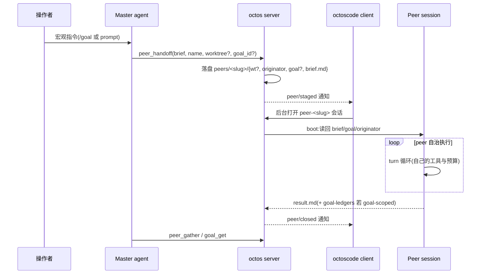

# 第 18 章:Goal 与 Peer:把目标从上下文里搬出来

> **定位**:本章分析 v2 新增的 goal 与 peer 两条线:goal 线 9 个文件合计 52,445 行(`crates/octos-cli/src/goal_tool.rs` 3,028、`crates/octos-fleet/src/sqlite_ledger.rs` 6,360 等),peer 线 9 个文件合计 5,969 行(`crates/octos-cli/src/peers/mod.rs` 3,186 等),合计近六万行新代码。它们回答同一个问题:长程目标放在模型的对话上下文里会腐烂,放在哪里才安全。前置依赖:第 5 章(§5.10 续跑边界)、第 12 章(supervisor 与租约)、第 16 章(Fleet 内核与 GoalLedger 所属 crate)。适用场景:要构建多 agent 长任务系统的开发者,以及关心「目标如何跨会话存活」的架构读者。本章也是第四部分外环(第 20 章)的前置:外环靠这些原语观测与驱动。

## 18.1 为什么把目标从上下文里搬出来

Claude Code 式的 goal 实现把目标文本每个 turn 注入上下文,依赖模型在微观执行中持续遵守它。实践中模型经常不遵守:跑几轮就停下来,或者被眼前的工具输出带偏。goal 文本挂在系统提示上,进度却记录在会腐烂的对话历史里,一次压缩就可能丢掉中间结论。`octoscode/docs/PEER_GOAL_ARCHITECTURE.md` 给出的失败模式描述是:目标活着,进度在腐烂(objective survives, progress rots)。

octos 的做法是把 goal 从微观上下文中取出来,交给服务端的 keeper 在宏观层持有和推进:keeper 定期用 `GoalContinue` 续跑 tick 派活、收账、决定下一步;派出去的 peer 在自己的微观上下文里只看到一份自包含的任务契约(brief),里面没有 goal 文本。goal 的持续性由结构保证,单个 peer 停了不影响 goal 前进。

这条设计线落在两个系统的分工上。goal 线持有与推进目标:`crates/octos-cli/src/goal_tool.rs`(3,028 行,首行文档注明它取代脆弱的提示词方案 #1696)、`commands/{goal,ledger}.rs`(1,116 + 240 行)、`autonomy/{goal_loop_runtime,master_continuation_scheduler,supervisor_store,fleet_wake}.rs`(1,562 + 1,416 + 3,277 + 1,807 行)、`crates/octos-fleet/src/sqlite_ledger.rs`(6,360 行)。peer 线执行:`crates/octos-cli/src/peers/mod.rs`(3,186 行)、`crates/octos-cli/src/peers/host.rs`(502 行)、`crates/octos-cli/src/commands/peer.rs`(211 行)与 `octos-agent` 里六个 peer 工具文件(合计 2,070 行)。goal 线 9 文件合计 52,445 行,peer 线 9 文件合计 5,969 行,体量差约九倍:持有目标的机器比执行目标的机器复杂得多。账本一个文件就 6,360 行,因为目标的每次状态转移、每条发现、每个升级请求、每条决策都要留审计痕迹;而 peer 的全部协议只是目录下的十来个小文件。

分层还有一个容易误判的细节:goal 的持有方不是某个独立守护进程,而是 `crates/octos-cli/src/autonomy/agent_orchestrator.rs`(33,639 行)里的 keeper 角色,`continuations` 字段(`:11783`)持有调度器,goal 的续跑、fleet 派发、账本归集都发生在 master 会话的编排器里。所谓「服务端持有」的准确含义是:持有者不是模型的对话上下文,而是编排器进程里的持久状态加磁盘上的两本账。这也是外环(第 20 章)能观测它的原因:状态在服务端,就有稳定的查询面。

| 线 | 文件数 | 行数 | 核心文件 |
|---|---|---|---|
| goal 线 | 9 | 52,445 | `crates/octos-fleet/src/sqlite_ledger.rs` 6,360、`crates/octos-cli/src/goal_tool.rs` 3,028、`crates/octos-cli/src/autonomy/supervisor_store.rs` 3,277 |
| peer 线 | 9 | 5,969 | `crates/octos-cli/src/peers/mod.rs` 3,186、六 peer 工具 2,070 |

与第 16 章的分工:fleet 内核(redb)管理计划与 attempt 的执行状态,`GoalLedger`(SQLite)管理目标、发现与升级的审计账本,两本账互不替代(第 16 章 §16.7 已划界)。与第 12 章的分工:supervisor 管会话内的子任务存活,peer 是跨会话的进程级实体。

## 18.2 GoalLedger:目标的第一本账

`crates/octos-fleet/src/sqlite_ledger.rs:13` 定义 `pub struct GoalLedger`,模块首行注释写明它是 goals、tasks、findings、escalations 的持久账本。它是 WAL 模式的 SQLite:master、进程管理器、peers 是独立进程,共享同一个 `<data_dir>/goal-ledgers/<goal_id>.db` 文件。`impl GoalLedger` 从 `:206` 到 `:2241`,共 39 个 pub fn,按用途分五组:

| 组 | 代表方法 | 行号 |
|---|---|---|
| 打开 | `open` / `open_with_busy_retry` | :222 / :245 |
| goal | `create_goal` :714、`upsert_goal` :811、`cas_goal_status` :899、`get_goal` :976、`update_goal_status` :1498、`stamp_goal_cleared` :2009 | — |
| task | `create_task` :1066、`create_task_if_absent` :1124、`get_task` :1166、`update_task_status` :1232、`settle_task_status` :1267、`tasks_for_goal` :1290 | — |
| 追加事件 | `append_finding` :1623、`append_escalation` :1635、`resolve_escalation` :1702、`list_open_escalations` :1745、`append_decision` :1807、`commit_state_with_audit` :1908 | — |
| 统计 | `list_findings_since` :2132、`task_status_counts` :2178、`total_cost_tokens` :2232 | — |

两个方法值得展开。`cas_goal_status`(`:899`)不是裸的 CAS,UPDATE 语句里嵌了一条预算规则:目标是 active 且 `tokens_used >= token_budget` 时,状态直接写成 `budget_limited` 而不是调用者要的新状态。预算检查在唯一的状态转移点执行,不依赖调用方自觉。`open_with_busy_retry`(`:245`,#1865)解决一个实测到的 WAL 初始化竞态:两个连接同时初始化同一个新库时,wal-index 恢复锁的争用不被 busy handler 覆盖,一次性 open 可能输掉毫秒级竞赛并静默丢审计行;该变体最多重试 3 次,每次间隔 50ms,并把 busy_timeout 压到 1 秒,只在错误被归类为 BUSY/LOCKED 时重试。

状态机的操作员出口在 `crates/octos-cli/src/commands/goal.rs`(1,116 行,#25):`octos goal reopen` 承认 `blocked|paused|budget_limited` 回 active,`octos goal archive` 承认任何状态进 `archived`,且 archived 是终态不可逆。观察出口在 `crates/octos-cli/src/commands/ledger.rs`:`octos ledger tail`(`:80`)直读 goal-ledgers 目录,零 serve 依赖。

预算是软限制。`budget_limited` 停掉的只是自我推进的 `GoalContinue` tick,在跑的 peer 继续跑完,外部唤醒仍然触发续跑。架构文档把这条权衡写得很清楚:不半路杀死正在工作的 peer,用户看到部分结果后再决定是否加预算;代价是预算可能超支,操作员要理解 budget limited 不是 stopped。

## 18.3 goal 工具族:keeper 的十个把手

`crates/octos-cli/src/goal_tool.rs` 定义 10 个工具,7 个 goal_* 加 3 个 monitor_*(#1977 零 token 监视器,keeper 门控:peers 不能布防)。每个工具的结构体与 `fn name()` 行号都列在事实表里:

| 工具 | 结构体 | 行号 | 职责 |
|---|---|---|---|
| `goal_get` | `GoalGetTool` | :350 / :404 | 读目标快照,折叠发现与升级 |
| `goal_plan` | `GoalPlanTool` | :561 / :575 | 把目标分解到持久 fleet |
| `goal_dispatch` | `GoalDispatchTool` | :766 / :780 | 把就绪任务派发到 worker 池 |
| `goal_grant` | `GoalGrantTool` | :861 / :875 | 批准 Blocked 任务的能力扩张请求 |
| `goal_deny` | `GoalDenyTool` | :1024 / :1050 | 拒绝升级请求,任务转 Failed |
| `goal_update` | `GoalUpdateTool` | :1163 / :1266 | 状态迁移,完成主张要过独立 verifier |
| `goal_create` | `GoalCreateTool` | :1495 / :1509 | 建目标,准入检查跨两次调用串行化 |
| `monitor_create` / `monitor_list` / `monitor_delete` | :1634 / :1824 / :1893 | — | 事件监视器三件套 |

接线在 `crates/octos-cli/src/runtime/profile.rs`:GoalGetTool `:1323`(带 `.with_data_dir`)、GoalCreateTool `:1326`、GoalUpdateTool `:1329-1337`(若配置了 verifier 车道则挂上)、GoalPlanTool `:1341`、GoalDispatchTool `:1342`、GoalGrantTool `:1349`、GoalDenyTool `:1353`。peer 会话侧的接线在 `crates/octos-cli/src/commands/chat.rs:859` 与 `:1574-1577`:goal 绑定的 peer 只拿到 `goal_get` 与 `goal_update`,能看到目标并把发现记回 master 的账本,拿不到 plan 与 dispatch,无权改写计划。

`goal_get` 是三条回流通道的汇聚点(`:357`、`:491`、`:501`):它先扫 `<data_dir>/peers/` 下的活体 peer(`data_dir.join("peers")`),再读 `<data_dir>/goal-ledgers/<goal_id>.db` 的持久 findings,分别以 `peer_findings`、`ledger_findings`、`open_escalations` 三个键注入快照(#1967),顺带附上账本摘要(#1945)。keeper 不需要知道 peer 在哪,`goal_get` 一次调用把账收齐。

完成判定在 `crates/octos-cli/src/autonomy/goal_loop_runtime.rs`:`GoalCompletionVerdict`(`:282`,Done / NotDone)由独立的廉价车道 verifier 给出,#1935 的注释直引 loop-engineering 的原则:agent 自己的完成主张只是主张,verifier 独立返回 Done 才允许转 Completed,NotDone 保持 Active。运行时类型同文件:`GoalId`(`:10`)、`GoalRuntimePolicy`(`:239`,cadence 加 max_continuations)、`GoalRuntimeState`(`:265`,Active/Paused/Completed/Failed)、`GoalRuntime`(`:305`)。预算耗尽的收尾指令装在 `GoalBudgetResolution`(`:298`)的 `wrap_up_prompt` 字段里,原文直传。

verifier 车道是在接线处注入的:`crates/octos-cli/src/runtime/profile.rs:1329-1337` 注册 GoalUpdateTool 时,若 profile 配置了 `goal_verifier_llm`,就以 `.with_verifier_provider` 挂上。没有配置时完成判定退回无 verifier 的路径,这条配置项因此是生产部署里「完成要不要双验」的总开关。plan 与 dispatch 两个工具同批接线(`:1341`、`:1342`,#1857 PR 5a):`goal_plan` 把目标分解到持久 fleet,`goal_dispatch` 把就绪任务发到活的 worker 池,升级决断 `goal_grant`(`:1349`)与 `goal_deny`(`:1353`)消费 Blocked 任务的出口,deny 若使 fleet 无法完成会顺带同步 per-goal 账本(#1964)。这四个工具把第 16 章的 fleet 内核接进 keeper 的工具面,本章只关心它们在 goal 叙事里的位置,状态机细节回到第 16 章。

## 18.4 续跑:GoalContinue 与 GoalWrapUp

第 5 章 §5.10 从 loop 视角看过 `MasterContinuationScheduler`,这里补 goal 侧的全部语义。`crates/octos-cli/src/autonomy/master_continuation_scheduler.rs`(1,416 行)的 `MasterContinuationReason`(`:137`)有六变体,goal 占两个:`GoalContinue`(`:141`)是自我推进的续跑,`GoalWrapUp`(`:147`,#1131)是预算耗尽后的收尾 turn,携带 wrap_up_prompt,渲染时必须原文使用,不走标准的推进模板。

`priority()`(`:152`)把两个变体映射到同一车道(`:161`),注释给出理由:wrap-up 是会话暂停前的最后一个 goal turn,不是特权 turn。优先级 rank(`:190-199`)四档:External=0、GoalContinue=10、ChildOrScatterJoinComplete=20、LoopFire=30,数值越小越先出队。`stable_name()`(`:169-176`)给去重与持久化一个稳定字符串:`goal_continue`(`:171`)与 `goal_wrap_up`(`:172`)。

入队点在 `crates/octos-cli/src/autonomy/agent_orchestrator.rs:12963`:构造 `MasterContinuationRequest::new("coding-autonomy-goal", ...)` 并以 `.with_goal_id` 携带目标身份,metadata 里带 objective 与 status。调度器本体 `MasterContinuationScheduler`(`:477`)持有方在 `crates/octos-cli/src/autonomy/agent_orchestrator.rs:11783` 的 `continuations` 字段;`enqueue_at`(`:532`)入队,`drain_ready`(`:687`)与 `drain_ready_for_session`(`:706`)按优先级出队。一个细节:30 秒的 `RECENT_CLAIM_GUARD_WINDOW`(`:33-35`)用于挡同键 External 的重复投递,而 LoopFire、GoalContinue、ChildCompleted 这些循环原因逐 tick 重入队,被刻意排除在设防之外,永不拒绝。

外部事件也能唤醒 keeper。`crates/octos-cli/src/autonomy/fleet_wake.rs`(1,807 行)是 fleet 内核 outbox 的消费者(PR 4a):后台任务认领持久 outbox 事件,把它转成 keeper 的续跑请求。耐久性规则写在模块文档里:只有唤醒已被持久化(`WakeCommit::Durable`)才 ack 事件,未持久化的事件留在认领态,租约过期后重投,崩溃夹在中间也不会丢唤醒。文档同时诚实标注:截至该 commit,生产路径还没有写入真实 fleet 事件,这个消费者靠单元测试的合成事件证明正确性,dormant but correct。它唤醒的前提也写得很窄:keeper 的工作区已加载,即交互式或已连接的 goal 会话;无头会话的再水化留给 PR 4b。纯函数核心 `drain_fleet_outbox_once`(`:235`)不持有单例,进程循环 `spawn_fleet_outbox_consumer`(`:343`)调编排器的 `drain_fleet_outbox`,后者供给的 commit 回调只在锁定运行时状态的一瞬做持久化。

supervisor 侧的支撑是 `crates/octos-cli/src/autonomy/supervisor_store.rs`(3,277 行):`SupervisorStore`(`:697`)持久化受监管 agent 组的状态,`load_state`(`:780`)在重启时把状态读回。第 12 章讲过它与租约的分工,这里只需要记住 goal 的续跑请求走的是同一条持久化路径,fleet_wake 的文档明说它的 commit 回调复用 peer 与 goal 唤醒共用的持久化管线。

把这一节的状态拼起来,goal 的状态机在两个层面运转。账本层面:`cas_goal_status` 与 `update_goal_status`(`:1498`)管理 active、complete、blocked、budget_limited、paused、cleared 这些字符串状态(`crates/octos-fleet/src/sqlite_ledger.rs:39` 注释状态集,终态保护为 complete 与 cleared 两种,`:914`/`:1512` 的 WHERE 子句可证);`archived` 不在账本状态集里,它是 supervisor 事件流侧的终态标记(`crates/octos-cli/src/commands/goal.rs:12-14` 注释明写 goal state 的权威源在 supervisor 事件流而非 SQLite goals 表),两本账的状态集不应混写,转移规则分操作员可达与模型可达两类——`crates/octos-cli/src/commands/goal.rs` 的注释写明 complete 与 blocked 只有模型可到,archived 只有操作员可到,reopen 只认 blocked、paused、budget_limited 三种入口。运行时层面:`GoalRuntimeState` 的四态(Active、Paused、Completed、Failed)是内存里的推进视图,`GoalRuntimePolicy` 的两个构造函数给出两种节奏:`fixed_interval` 按固定间隔心跳,`self_paced` 由信号驱动,两者都受 `max_continuations` 封顶。两层的状态由 keeper 对齐:每次 `GoalContinue` tick 读账本、比预算、决定入队下一个 tick 还是转 wrap-up。goal 侧入队测试(`:1185`)还验证了去重键携带 goal_id,同一会话两个不同的 goal 不会在队列里互相挤掉。

## 18.5 Peer 生命周期:六个阶段

peer 的心智模型来自操作系统:subagent(`SpawnTool`/`DelegateTool`)像线程,在父 turn 内派生,共享父的上下文与工作区,父 turn 结束就终止;peer 像 fork 出去的进程,有自己的 session、工作目录、turn 循环与预算,parent 挂了它照跑。两者之间不共享内存,通信走黑板文件,等价于 IPC。



六个阶段各有落点:

1. **Stage**。`stage_peer`(`crates/octos-cli/src/peers/mod.rs:1563`)在 `peers/<slug>/` 下按固定顺序落盘:worktree(`:1598`)、originator(`:1702`)、goal(`:1729`)、brief.md(`:1738`)、name(`:1752`)。顺序本身就是发布不变量,18.6 展开。模型侧的入口是 `peer_handoff` 工具(`crates/octos-agent/src/tools/peer_handoff.rs:133`),它只做参数校验(brief 上限、name 上限 64 字符、重复名直接拒绝而不自动加后缀),staging 落盘由 host 回调执行。
2. **Staged 通知**。server 只负责 stage,session 由 client 打开(session 与 client 连接耦合)。`peer/staged` 通知的意思是已落盘、请 client 打开,client 收到后在后台打开 `peer-<slug>` 会话。这层职责切分是刻意的:server 不知道 client 的窗口管理,client 不知道 staging 的文件协议。
3. **Client 打开**。peer 会话在自己的 topic 下建立,session key 以 `peer-<slug>` 前缀标识,这个前缀后来被 depth-1 治理复用。
4. **Boot 读回**。`crates/octos-cli/src/peers/host.rs:96` 的 `read_peer_boot` 从黑板读回执行上下文:`:99-116` 解析 goal 文件(第一行 goal_id,第二行 task_id,goal_id 为空则把孤立的 task_id 丢弃,不给 agent 塞一条悬空子任务),originator 只在 boot 读一次,防止运行中被重绑定;brief 按 1 MiB 上限读取。每个字段独立可选:没有 goal 或没有 brief 的 peer 是降级而非致命,只有 slug 不是真实 staged 目录才返回空。
5. **运行**。peer 有完整的 turn 循环与工具集。终局产物由 `crates/octos-cli/src/api/ui_protocol_transport.rs:14279` 的 `write_peer_result_if_peer_session` 写回黑板:frontmatter 四字段(slug/outcome/updated_unix/turn,`:14334`),turn 号由已有的 `result-<n>.md` 计数加一推出(`:14328-14329`),正文上限 256 KiB(`:14306`)。预算耗尽的 peer 写的是另一份五字段检查点副本(`crates/octos-agent/src/agent/budget.rs:584`:status/completed/iteration_budget/iterations_used/checkpoint_commit),工作进度以 commit 形式留在分支上,未完成三个字明示,提示重新派发时提高上限或拆小任务。若 peer 持有写权(`.result-owner: peer` 侧车,#27f/#27h),runtime 不得覆盖它的终局,peer 手写的内容自由,不受四字段模板约束。
6. **Closed 与 gather**。`closed` 墓碑文件标记终局(`peer_is_closed`,`:1317`),`peer/closed` 通知 client 更新界面;master 用 `peer_gather` 拉取 result.md,或直接 `goal_get` 收账。命令行观察面是 `octos peer list`(`crates/octos-cli/src/commands/peer.rs:54`),同样直读黑板目录,零 serve 依赖。

## 18.6 黑板:文件布局就是协议

peer 与 master 之间没有共享内存,`peers/<slug>/` 下的文件就是协议本体:

```text
<data_dir>/
├── peers/<slug>/
│   ├── brief.md          # 任务契约,≤64KB,peer 看到的全部输入
│   ├── name              # 显示名,主寻址键
│   ├── originator        # master session key,boot 读一次
│   ├── goal              # 两行:goal_id 与 task_id,goal-scoped 才有
│   ├── result.md         # 活体成果,会被覆盖
│   ├── result-<n>.md     # 版本化副本(#435),count_peer_result_versions :2592
│   ├── result.checkpoint.md  # 预算检查点副本(#27e)
│   ├── turns.txt         # 行式 turn 索引,parse_peer_turns_index :2649
│   ├── closed            # 墓碑,peer_is_closed :1317
│   ├── model             # 车道键,read_peer_model_lane :2189
│   └── wt/               # worktree 模式下的隔离 clone
└── goal-ledgers/<goal_id>.db  # 持久账本:findings 与状态转移
```

`stage_peer` 的写入顺序承载两条不变量。其一,brief.md 是可见性门:`staged_peer_dir`(`:417`)以 brief.md 存在判定 peer 是否存在,所以 brief.md 必须最后写,写完 peer 才「存在」;此前任何失败都走 `cleanup_staged_peer` 整体回收,不会留下一个可见但不完整的 peer。其二,originator 在 brief.md 之前写入,保证任何能看到该 peer 的 fleet 所有权扫描也能读到它的 owner,不出现「可见但无主」的窗口——无主窗口的害处具体:兄弟 peer 完成时触发的合成会把这个 peer 静默漏掉。goal 文件(`:1729`)同样先于 brief.md 落盘。name(`:1752`)是显示名与主寻址键,staging brief 同时记为第一轮指令历史,让指令历史从工作开始处起步,brief.md 本身保持权威。

叶子不止这些。`result-<n>.md` 是版本化副本(#435):`count_peer_result_versions`(`:2592`)数一遍 `result-` 前缀文件就得出版本号,持久 peer 跑多轮不会静默覆盖旧成果;`result.checkpoint.md` 是 #27e 预算检查点的侧车,peer 持有写权时由 peer 自己写;`turns.txt` 是行式 turn 索引,`parse_peer_turns_index`(`:2649`)逐行解析;`closed` 是墓碑(`peer_is_closed`,`:1317`);`model` 记车道键(`read_peer_model_lane`,`:2189`)。

读路径有对称的防备。所有文件读取都锚定在 fd 上(openat 加 renameat 的原子写),拒绝符号链接;读上限分档:小文件 64 KiB(`PEER_FILE_READ_CAP_SMALL`,`:462`),brief 与 result 1 MiB(`PEER_FILE_READ_CAP_LARGE`,`:457`);brief 写入上限 64 KB(`PEER_BRIEF_MAX_BYTES`,`:1422`)。寻址以 name 为主键:`resolve_peer_name_to_slug`(`:1329`)把人类可读名解析到 slug,大小写不敏感。黑板的行视图是 `PeerBlackboardRow`(`:2676`,slug、name、brief、result、turn 历史、车道、closed、有无 worktree),`read_peer_blackboard`(`:2714`)枚举目录组装,`compose_peer_list_text`(`:2802`)渲染成 peer_list 的输出。这层文件协议的每个读写都有上限、有原子性、有版本化,是「黑板」二字能承担进程间通信职责的全部理由。

## 18.7 Worktree 的真相:clone,不是 worktree

`--worktree` 名义上叫 worktree,实现是 `git clone --no-hardlinks`(`crates/octos-cli/src/peers/mod.rs:1638` 与 `:1640`,clone 与 --no-hardlinks 两个参数各占一行)。源码注释(`:1624` 起)记录了为什么必须如此:`git worktree add` 建出的 `.git` 是一个文件,指向 `<repo>/.git/worktrees/<name>`,那个目录在 peer 的沙箱之外,于是 peer 里跑任何 git 命令都报 `fatal: not a git repository`,模型还会用 `git init` 自救,把栅栏分支彻底毁掉,交付物永远落不了盘。clone 把完整 `.git` 放进 `peers/<slug>/wt`,git 正常工作,无需放宽沙箱,一个 peer 也够不到另一个的 refs。

`--no-hardlinks` 的理由同样写在注释里:默认的本地 clone 优化会让子库与源仓共享对象文件的 inode,peer 写自己的 `.git` 时可能腐蚀源仓对象;隔离是这个特性的全部意义,所以宁可付出每个 peer 一次真实对象拷贝的成本。代价明示:如果 staging 延迟成为问题,凭证据再重新评估。克隆之后,peer 的栅栏分支在自己的克隆里 checkout(`peer/<slug>` 分支),克隆也不继承源仓的 LOCAL config。

## 18.8 绑定与三条回流通道

goal 与 peer 的连接点在 handoff 参数与 goal 文件。`PeerHandoffRequest`(`crates/octos-agent/src/tools/peer_handoff.rs:35`)携带可选的 `goal_id` 与 `task_id`;master 在活跃 goal 下 handoff 时传入,server 把它们原子写入 `peers/<slug>/goal` 两行文件。没有 goal 文件的 peer 行为与普通 peer 完全一致。peer 侧不拥有 goal:boot 读回绑定后,它的 `goal_get` 按记下的 goal_id 与 originator session 直接按 id 解析到 master 的 goal,把发现记进 master 的账本。


三条回流通道在 `goal_get` 汇聚:live 通道读 `peers/<slug>/result.md`,快但是会被覆盖;durable 通道走 `GoalLedger::append_finding`(`:1623`),每个 goal-scoped peer 完成 turn 时落盘,重启后仍在,是权威历史;escalation 通道在 peer park 在审批或提问时写 `append_escalation`(`:1635`),master 错过实时通知也能在 `goal_get` 的 `open_escalations` 里看到谁在等,批准走 `peer_respond` 或 `goal_grant`。设计意图是把「错过通知」从异常路径变成普通读路径。

工程实测的陷阱必须写进文档:模型不会自动传 `goal_id`。master 没有活跃 goal,或 prompt 没有要求绑定时,handoff 出来的是普通 peer,产出不进 goal 账本。测试回流链路时要显式要求绑定。这正是架构文档把它标注为实测陷阱的原因:工具的默认值是「不绑定」,而绑定的收益(durable 历史、goal_get 收账)只在显式传参后才存在。

车道参数在同一份请求里:`model`(`crates/octos-agent/src/tools/peer_handoff.rs:59`)是 master profile 里 `sub_provider` 的键(与第 9 章互引),host 校验键存在性,未知车道降级主模型并以 `PeerHandoffStaged.model_note`(`:86`)如实回告;匹配的键记录进 `model` 文件(`record_peer_model_lane`,`:2205`),peer 的 turn 按该车道解析 provider。

## 18.9 治理:三条硬约束

peer 机制给了模型 fork 的能力,治理约束全部在 serve 接线处强制,不靠提示词:

- **Depth-1**:peer session 的 topic 以 `peer-` 前缀标识,`peer_handoff_allowed_for_session`(`crates/octos-cli/src/peers/mod.rs:1934`)看到该前缀直接拒绝,peer 的工具注册表里根本没有 `peer_handoff`,模型看不见它。peer 不能再 fork peer,递归在工具可见性层面就被切断(`crates/octos-agent/src/tools/peer_handoff.rs:12-13` 注释自证)。
- **Per-turn 上限**:`PEER_HANDOFFS_PER_TURN_MAX = 4`(`:1928`),强制点在 `:2062`,超出即返回错误。一个 turn 最多派四个 peer,扇出不失控。
- **Brief 上限**:`PEER_HANDOFF_BRIEF_MAX_BYTES = 64 * 1024`(`crates/octos-agent/src/tools/peer_handoff.rs:27`),注释的口径是 brief 是任务契约,不是 blob 存储;server 侧 `PEER_BRIEF_MAX_BYTES`(`crates/octos-cli/src/peers/mod.rs:1422`)同值镜像。

master 侧的工具族共六个,覆盖 peer 的完整操作面:`peer_handoff`(staging,`:133`)、`peer_list`(roster,`:56`)、`peer_gather`(收成果,`:64`)、`peer_respond`(回答 park 住的 peer,`:148`,控制通道)、`peer_close`(`:62`)、`peer_send_input`(`:90`)。

> **工程决策:peer 是进程,subagent 是线程**
> subagent 在父 turn 内派生,共享上下文与工作区,结果作为工具结果直接回到父上下文,父 turn 被打断则随之终止:这是线程语义,轻量,命运与父进程绑定。peer 有独立 session、可隔离的工作目录、自己的 turn 循环与 token 预算,parent 挂了它照跑:这是进程语义,隔离换开销。选择标准是失败域:任务崩了要不要拖垮父会话,交付物要不要在重启后仍在磁盘上。黑板文件是两者的 IPC:不共享内存,契约(brief)与成果(result)都是普通文件,任何一侧崩溃后另一侧照常读取。`PeerTaskBinding`(`crates/octos-cli/src/peers/mod.rs:166`)把 peer 绑到 supervisor 的租约上(`bind_peer_supervised_task`,`:241`;`retire_peer_supervised_task`,`:264`),peer 存活与 supervisor 租约一致,第 12 章的租约语义在此复用。

## 18.10 边界与回顾

与第 5 章:`MasterContinuationScheduler` 的数据结构第 5 章 §5.10 已从 loop 视角讲过,本章补的是 goal 侧的全部变体与外部唤醒;第 5 章末尾「第 18 章:MasterContinuationScheduler 的消费侧与 goal 续跑全貌」的前向引用至此落地。与第 12 章:supervisor 的事件账本与 `SupervisorStore`(`:697`/`:780`)管会话内子任务,`PeerTaskBinding` 是 peer 借用该机制的生命线;lease 的完整状态机留在第 16 章。与第 16 章:fleet 内核的六张 redb 表管计划执行,`GoalLedger` 管目标审计,`goal_plan`/`goal_dispatch` 在 keeper 之上把两者接起来;escalation 的 grant 决断(`goal_grant`/`goal_deny`)消费第 16 章 Blocked 状态机的出口。外环协议本身(第 20 章)与 TUI 显示(第 19 章)不在本章范围。

本章回顾:

1. goal 持久化在服务端:`GoalLedger` 39 个 pub fn 分五组管目标、任务、事件与统计,`cas_goal_status` 把预算规则嵌进唯一的状态转移点,budget_limited 是软限制。
2. keeper 的十个把手:7 个 goal_* 工具加 3 个 monitor_*,peer 侧只接线 `goal_get` 与 `goal_update`,计划权不下放。
3. 续跑有优先级:GoalContinue 与 GoalWrapUp 同车道,wrap-up 是最后一个 turn 而非特权 turn;fleet_wake 的唤醒先持久化再 ack,不丢事件。
4. peer 的协议是文件:写入顺序(brief.md 最后)承载可见性不变量,result 有活体与版本化两份,终局四字段 frontmatter,检查点五字段。
5. worktree 实为 `git clone --no-hardlinks`:`.git` 必须完整落在沙箱内,共享 inode 会腐蚀源仓,隔离优先于 staging 延迟。
6. 绑定显式、回流三通道:`goal` 两行文件 + goal_id 必须显式传,成果经 peer_findings、ledger_findings、open_escalations 汇聚到 `goal_get`。
7. 治理三条硬约束在接线处强制:depth-1 靠工具不可见,per-turn 上限 4,brief 上限 64KB。

---

数据库文件 `goal_ledger.sqlite` 由 keeper 进程独占持有,worker 与 transition 只经 WAL 侧读写,这一持有关系是恢复语义的地基。

## 延伸阅读

- `octoscode/docs/PEER_GOAL_ARCHITECTURE.md` — 设计渊源、绑定与回流、budget 软限制的原始架构文档,本章多张图取材于此并按源码校验
- `crates/octos-fleet/src/sqlite_ledger.rs` — GoalLedger 全部 39 个公开方法与 #1865 竞态注释
- `crates/octos-cli/src/peers/mod.rs:1624-1640` — clone 而非 worktree 的完整论证注释
- 第 16 章 `docs/FLEET-RUNTIME-ADR.md` — goal 与 fleet 分层的架构决策记录

## 思考题

1. `cas_goal_status` 把预算判定嵌进 UPDATE 的 CASE 表达式。若把同样的判定移到工具层(先读 tokens_used 再写状态),什么并发窗口会让超预算的目标继续转?WAL 模式下两个进程同时执行这条 UPDATE 会发生什么?
2. brief.md 是可见性门,必须最后写。若 name 文件写在 brief.md 之后,staged 通知发出前进程崩溃,会出现什么状态的 peer?`resolve_peer_name_to_slug` 会怎样处理它?
3. `--no-hardlinks` 付出每个 peer 一次完整对象拷贝。若源仓有 2 GB 对象、要派 20 个 peer,staging 成本如何估算?有什么方案能把成本降下来而不重新引入共享 inode 的腐蚀风险?
4. 模型不自动传 `goal_id` 是实测陷阱。若要在 `peer_handoff` 里加一个「master 有活跃 goal 时默认绑定」的策略,需要改哪些校验?这个默认值反过来会伤害哪类「与 goal 无关的委派」场景?
5. GoalWrapUp 与 GoalContinue 同优先级车道。若给 wrap-up 单开一个更高优先级,预算耗尽瞬间的收尾 turn 会以什么顺序与其他会话的 GoalContinue 竞争?为什么设计者认为它不该是特权 turn?

---

> **版本演化说明**
> 本章为 v2 新增章,分析基线 octos main @ `9c157101`(2026-09-03 采集复核)。goal 与 peer 两条线均为新代码:goal 工具族源自 #1696(取代提示词方案),peer 机制源自 #1801 v3,续跑调度源自 M15,预算收尾源自 #1131,monitor 族源自 #1977,peer-goal 绑定与回流源自 #1967 与 #1945。所有行号与行数来自事实表 `assets/ch18-facts.md`(commit 8a008e5 同批入库)或本次会话对源码的只读核对;第 5 章 §5.10 与第 12 章对本章的前向引用在此落地。result.md frontmatter 的实测口径(runtime 副本四字段、检查点副本五字段)以源码为准,不沿用早期 spec 的六字段表述。
