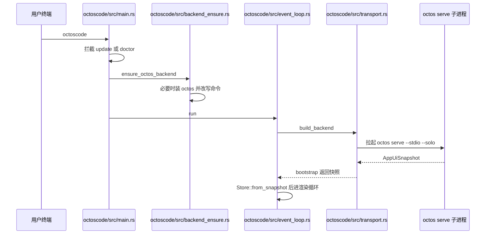
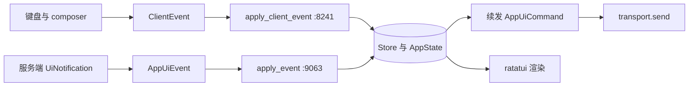
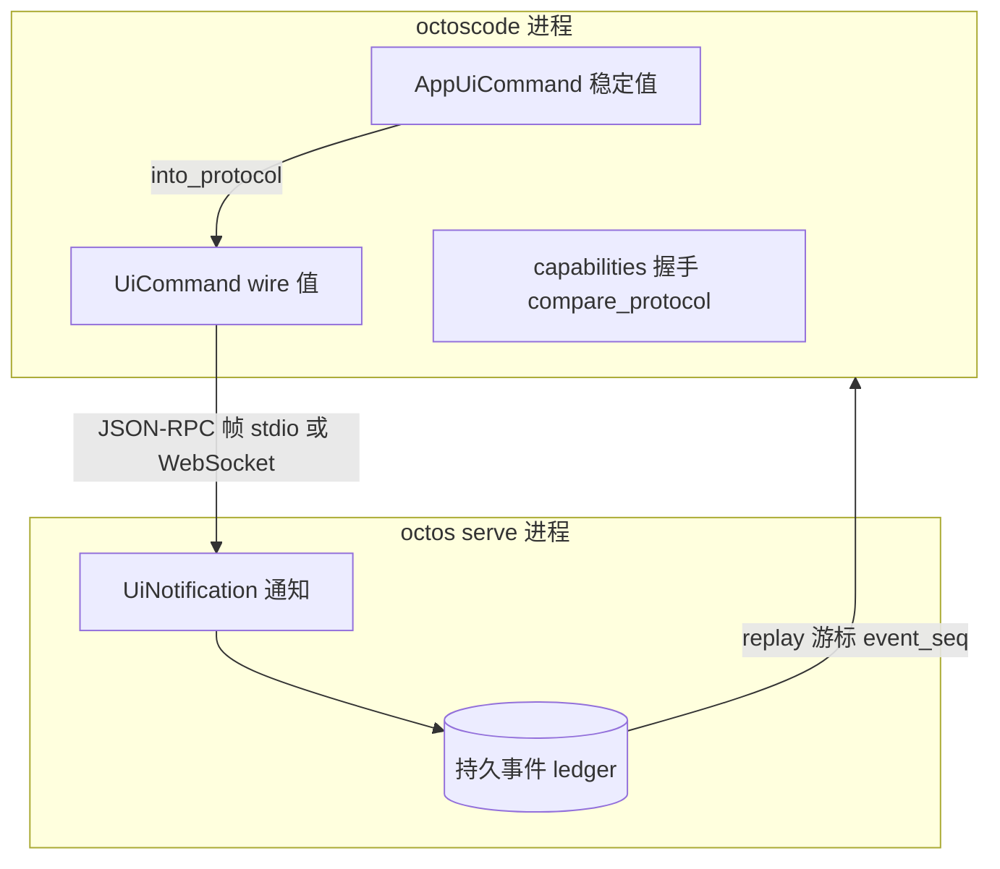

# 第 19 章:octoscode:终端客户端与 UI Protocol

> **定位**:本章解剖 octoscode,octos 的终端客户端:它不跑 agent、不执行工具、不持有账本,只经 UI Protocol 与 `octos serve` 通信。启动链、传输层、reducer、协议契约、goal/peer 的客户端侧与外环观测面在这里汇成一条线。前置依赖:第 14 章(serve 控制面与 stdio 挂载面)、第 18 章(goal/peer 服务端机制)。适用场景:要为 octos 编写客户端、把 TUI 接入自己的观测系统,或思考「客户端到底应该有多薄」的开发者。

## 19.1 客户端边界:一个不执行任何东西的终端

先给结论:octoscode 在协议模式下是一个哑客户端。`octoscode/docs/ARCHITECTURE.md:3` 的 Scope 节用一句话划定了边界:

> octoscode is a standalone terminal client for the Octos UI Protocol. In protocol mode it does not run the Octos agent, execute tools, approve commands, maintain the durable ledger, or own provider/model configuration. Those responsibilities belong to the `octos serve` process.

翻译成清单:不运行 agent、不执行工具、不做审批决定、不维护持久账本、不持有 provider/model 配置,这五件事全部属于 `octos serve` 进程。TUI 拥有的只有呈现:终端渲染与键盘、本地视图状态(焦点、滚动、展开、composer 草稿)、用户 prompt 的乐观显示、本地 slash 命令(`/ps`、`/stop`、`/help`),以及把用户交互翻译成稳定的 `AppUiCommand` 值。服务端拥有的则是会话创建与 cwd 校验、agent 运行时、shell/工具执行与沙箱策略、审批请求与决定、task supervisor 与后台任务注册表、持久 UI 事件 ledger 与 replay、diff 预览与任务输出数据源。

这份边界的价值由架构不变量兜底(`octoscode/docs/ARCHITECTURE.md:713` 起的 Architectural Invariants 一节):octoscode 不得直接调用 Octos 运行时内部;不得依赖 AppUI 之外的 M9 服务端内部;必须把服务端视为任务、审批、diff、工具结果、cwd 策略、沙箱策略与 replay 的权威;服务端不得要求 TUI 特有行为才能保证协议正确;新的客户端可见能力必须先落进 `crates/octos-core` 的 UI Protocol 类型,再落 TUI 渲染;面向编码体验的提示词整形属于服务端 profile 或 harness 提示词契约,不属于客户端。换句话说,客户端与运行时之间只允许存在一条合同:协议。

体量上,octoscode 的 `src/` 顶层有 26 个文件共 96,124 行(含内嵌测试),最大的是 `octoscode/src/store.rs`(43,935 行,reducer,内嵌测试),其次是 `octoscode/src/model.rs`(12,884 行)、`octoscode/src/transport.rs`(12,214 行)、`octoscode/src/event_loop.rs`(8,655 行)、`octoscode/src/app.rs`(6,286 行);子目录还有 `app/` 5 个文件、`cmd/` 8 个、`menu/` 10 个。入口之外另有几件周边设施:`octoscode/src/backend_ensure.rs`(1,317 行)管后端自动安装,`octoscode/src/autonomy.rs`(1,192 行)管 goal/peer 的客户端侧解析,`octoscode/src/tui_terminal.rs`(1,171 行)是从 codex-rs 裁剪移植的内联视口终端,`octoscode/src/insert_history.rs`(1,602 行)负责把定稿输出写回终端原生回滚区。一个「什么都不执行」的客户端接近十万行,这个反差正是本章要解释的:薄的是职责,不是代码量,把交互做厚、把权限做薄,本身是重活。

对照物有助于理解这条边界画在哪里。架构文档末尾的对照模型(`octoscode/docs/ARCHITECTURE.md:666`)把 Codex 式本地 CLI 与 Octos 的拆分并列成一张表:Codex 式客户端进程自己拥有运行时(工具执行在本地沙箱、审批策略在本地、会话与重放在本地),模型服务只提供推理;Octos 把这些全部移进 `octos serve`,客户端只剩渲染与交互。两种都能做出好的编码体验,差别在可替换性与观测面:Octos 的终端应用可以整体替换,所有客户端说同一套 AppUI API,而运行时状态集中在服务端,外部观测器不必侵入客户端就能读到底牌。

> **工程决策:哑客户端的取舍**
> 哑客户端牺牲了本地自治:没有服务端,octoscode 连一次 shell 都不能替你跑(mock 模式只是渲染测试夹具)。换来的是三样东西。第一,安全边界唯一化:工具执行、沙箱、审批全部在服务端强制,客户端被攻破也拿不到执行权,策略不需要在两端各实现一遍。第二,客户端可替换:`octoscode/docs/ARCHITECTURE.md:666` 的对照模型把 Codex 式本地 CLI(运行时就在 CLI 进程里)与 Octos 的拆分并列,结论是终端应用可整体替换,所有客户端说同一套 AppUI API。第三,观测可外置:状态都在服务端与协议流里,外部进程不必侵入客户端就能观测(第 21 章的 herdr 正是利用这一点)。代价是协议本身必须足够厚,7,221 行的 wire 类型(见 19.5 节)就是这笔账单。

## 19.2 启动链:57 行的 main 到 4.4 万行的 reducer

octoscode 的二进制入口极小,`octoscode/src/main.rs` 全文 57 行,`fn main()` 在 `octoscode/src/main.rs:4`:

```rust
fn main() -> Result<()> {
    color_eyre::install()?;
    install_terminal_restoring_panic_hook();
    // 拦截 update/doctor 子命令,命中则直接退出
    if let Some(code) = cmd::dispatch(std::env::args())? {
        std::process::exit(code);
    }
    let mut cli = Cli::parse()?;
    // 本地 stdio 启动且未安装 octos 时,先装好后端
    backend_ensure::ensure_octos_backend(&mut cli)?;
    octoscode::splash::play(&cli);
    event_loop::run(cli)
}
```

四步的顺序都有讲究。第一步拦截 `update`/`doctor` 子命令(`octoscode/src/main.rs:10`):这两个命令要在终端还是普通模式时输出,不能进事件循环。第二步 `ensure_octos_backend`(`octoscode/src/main.rs:22` 调用,实现在 `octoscode/src/backend_ensure.rs:113`)必须在进入 raw mode 之前执行,注释写明原因:安装器的输出要能干净地打印在终端上。第三步播放启动 splash。第四步才进入 `event_loop::run`(`octoscode/src/event_loop.rs:192`)。

`ensure_octos_backend` 的生效条件相当克制,读 `octoscode/src/backend_ensure.rs:113` 起的实现可以列出四个提前返回:非 Protocol 模式(mock 不拉子进程)直接返回;`stdio_command` 为空(WebSocket 启动,没有本地后端可装)返回;命令不是裸 `octos`(用户自管路径、PATH 覆盖或非 octos 命令,不去碰)返回;已在 PATH 上解析到也返回。只有「协议模式 + 裸 octos + 本地未装」这一种情形才触发安装,新装完成后把 `cli.stdio_command` 改写为 `~/.octos/bin/octos` 的显式路径。首启体验由此接通:用户拿到一个新 octoscode,敲下去,它自己把服务端装好。

默认的拉起命令是常量,`octoscode/src/cli.rs:118`:

```rust
pub const DEFAULT_STDIO_COMMAND: &str = "octos serve --stdio --solo";
```

缺省回填发生在 `octoscode/src/cli.rs:415` 与 `octoscode/src/cli.rs:849`。这条命令的语义在第 14 章已经拆过:`--stdio` 让 serve 不绑定 HTTP,UI Protocol 的 JSON-RPC 走 stdin/stdout;`--solo` 限定单会话姿态。整条启动链如下。



## 19.3 传输层:一个 trait,两种驱动

传输层的全部抽象是三个方法,`octoscode/src/transport.rs:238`:

```rust
pub trait AppUiBackend {
    fn bootstrap(&mut self) -> Result<AppUiSnapshot>;
    fn send(&mut self, command: AppUiCommand) -> Result<()>;
    fn next_event(&mut self) -> Result<Option<ClientEvent>>;
}
```

`build_backend`(`octoscode/src/transport.rs:244`)按模式二选一:mock 走 `MockAppUiBackend`(`octoscode/src/transport.rs:4542`,实现在 `octoscode/src/transport.rs:4699`),协议走 `ProtocolAppUiBackend`(`octoscode/src/transport.rs:311`,实现在 `octoscode/src/transport.rs:1585`,`AppUiBackend` 实现块在 `octoscode/src/transport.rs:2235`)。mock 的定位在架构文档里写得很硬:确定性渲染夹具,不得用来验证服务端策略、沙箱、provider 配置、账本持久化或工具执行。

连接目标由 `AppUiEndpoint`(`octoscode/src/transport.rs:190`)表达,两个变体:`WebSocket { url, auth_token, profile_id }` 与 `Stdio { command }`。对应的驱动分别是 `WebSocketTransportDriver`(`octoscode/src/transport.rs:556`)与 `StdioTransportDriver`(`octoscode/src/transport.rs:566`)。选择权在 CLI:`--endpoint` 指定 UI Protocol v1 WebSocket 端点(`octoscode/src/cli.rs:126`,解析在 `octoscode/src/cli.rs:204` 起的参数定义),不指定则走 stdio 子进程。两条路的差别不止传输介质:WebSocket 重连只是重连,服务端与其中会话还活着;stdio 的「重连」意味着重新拉起子进程,好在 solo 模式的数据目录由 `OCTOSCODE_SHARED_INSTANCE` 环境变量锚定,重拉会重新附着到同一目录而不是分叉出新库(注释见 `octoscode/src/transport.rs:997` 附近)。数据目录被占用时,服务端输出 `OCTOS_DATA_DIR_LOCKED` 标记,客户端靠识别这个 token 停止重启循环,第 14 章已从 serve 侧讲过同一机制的重放。

重连退避是指数级的:首次重试前有基础延迟,连续失败逐次翻倍,封顶有上限(常量与注释在 `octoscode/src/transport.rs:354` 起)。所有驱动停止的报错文案都带同一句式「reconnect will retry on next send/read」,把重连时机统一推迟到下一次读写,而不是在后台空转。

`bootstrap`(`octoscode/src/transport.rs:2235` 起的实现)做的事按序排列很有信息量:先建连,`--readonly` 启动连不上时不报错,而是返回一个只读离线快照供检视;接着发 capabilities 请求(协议握手,见 19.5 节);带了 profile 就发 `ProfileLlmList`;带了 session_id 就发 `OpenSession`(`SessionOpenParams` 携带 session_id、profile_id、请求的 cwd 与已知的 replay 游标);最后用启动参数拼出首帧 `AppUiSnapshot` 返回。事件循环拿到快照,`Store::from_snapshot`(`octoscode/src/event_loop.rs:230` 调用)完成冷启动水合。

## 19.4 Store:4.4 万行的 reducer

客户端的状态机是一个函数式 reducer:`octoscode/src/store.rs:287` 定义 `pub struct Store`,唯一字段是 `AppState`;`octoscode/src/store.rs:423` 的 `from_snapshot` 把服务端快照折叠成初始状态。此后一切状态变化走两个入口,签名都返回 `Option<AppUiCommand>`:

- `apply_client_event`(`octoscode/src/store.rs:8241`):消费 `ClientEvent`,即传输层解码后的事件;
- `apply_event`(`octoscode/src/store.rs:9063`):消费 `AppUiEvent`,服务端通知与本地事件的统一形状。

这个文件是全仓最大的单体源文件,43,935 行,比第二名的 `octoscode/src/model.rs` 还多三万行,而且这个体量是结构性的,不是债务堆积。把它的职责按 `AppState` 的字段族拆开看,reducer 要折叠的东西覆盖客户端可见的全部世界:会话与线程树、消息与推理增量的逐字累积、工具卡片与 diff 预览、审批请求的等待与解除、后台任务注册表与输出流、composer 草稿与多条 pending 消息、菜单栈与 Dock 布局、能力集与权限 profile、goal 面板与 peer 名册。每一族都对应 `UiNotification` 全集里的一组通知,服务端发出的事件形态有多少种,`apply_event` 的 match 臂就有多少类。这解释了为什么 reducer 不能小:它是 wire 契约的完整消费者,协议有多厚,状态机就有多厚。

事件折叠之外,store 还负责把用户的原始输入翻译成命令。架构文档的 Client Layers 表给它的职责描述是「snapshots, RPC results, notifications, local commands, approvals, diffs, task output and queued prompts folded into AppState」:快照、RPC 结果、通知、本地命令、审批、diff、任务输出与排队 prompt,八类输入一个入口。slash 命令的分派链也住在这里,`Store::dispatch_slash_command` 往下分到 `dispatch_command_entry` 与 `dispatch_autonomy_slash`,`octoscode/src/store.rs:291` 附近的文档注释专门定义了分派结果 `SlashCommandOutcome`:一条命令可以解析成已知动词但仍在分派时被拒(readonly 模式拦下变更方法、没有活动 turn 时拒 `/turn`、autonomy 解析报错),历史记录只在真正接受后才写入,这是 composer 命令历史的正确性前提。排队 prompt(pending messages)的入队与释放同样在 reducer 内完成,网络断开时用户的输入不丢,重连水合后按序补发。

架构上有一个值得点名的反向约束:store 的两个入口不仅改状态,还产生续发命令,这让 reducer 同时是「状态机」和「跟进命令构造器」。设计者显然清楚 4.4 万行的风险,应对方式不是拆文件,而是把全部状态迁移收敛到单点:任何旁路直接改 `AppState` 的写法都会让回放与重连的水合逻辑出现第二个真相源。第 18 章服务端 GoalLedger 用 39 个方法把状态转移收进一个 impl 块,是同一种纪律在服务端的镜像:状态迁移的入口必须唯一,哪怕 impl 块因此变得巨大。

返回值可续发命令是这套设计的关键:reducer 不是纯折叠,它还能产生下一步动作。架构文档的 Turn Flow 给出标准例子:用户在 composer 按回车,`compose_command` 生成新的 turn_id、本地先乐观追加用户消息、返回 `AppUiCommand::SubmitPrompt`;传输层发 `turn/start`;服务端持续发出 turn、message、tool、approval、task、progress、warning 事件;每个事件经 `apply_client_event` 折叠,折叠可能触发后续命令,例如 diff 审批请求到达后自动补发 `diff/preview/get`。

`ClientEvent`(`octoscode/src/client_event.rs:25`)是客户端内部的事件全集,第一个变体 `App(Box<AppUiEvent>)` 承载来自 `crates/octos-core/src/app_ui.rs:172` 的 `AppUiEvent`(五个变体:Snapshot、Protocol、Progress、Status、Error),其余变体是传输层本地解码的 RPC 结果:capabilities、diff 预览、模型列表、MCP 状态、权限 profile、会话水合、会话列表、launch 决议等。`From<AppUiEvent> for ClientEvent`(`octoscode/src/client_event.rs:132`)把两者接起来。值得注意的分工:wire 层的 `UiNotification` 在传输层解码,`ClientEvent` 里没有它的身影,服务端通知统一以 `AppUiEvent::Protocol` 的形状进入 store,客户端状态机不感知传输介质的差异。

事件循环对这两个入口的驱动只有一种形状(`octoscode/src/event_loop.rs:755` 的 `drain_backend_events`):每 tick 最多排空 `MAX_BACKEND_EVENTS_PER_TICK` 个事件,逐个交给 `apply_client_event_and_send_followup`(`octoscode/src/event_loop.rs:816`):折叠,若有续发命令就 `send_command`。排空后还会调 `drain_pending_autonomy_hydration`(`octoscode/src/event_loop.rs:830` 附近),把重连后 store 暂存的水合命令(如 session 重开)按队列上限补发出去。发送失败绝不静默(`octoscode/src/event_loop.rs:833` 起的 `send_command`):#27 外环评审的结论是必须把失败按方法名报给用户,否则 TUI 显示「已重连」而输入其实无处可去。

首帧之前还有一个只发生一次的等待:`drain_initial_startup_events`(`octoscode/src/event_loop.rs:786` 附近)在首次启动时给 capabilities 握手一个有界的机会,因为首启 onboarding 是能力门控的,握手未到就画首帧会闪出空 composer;常规启动(本地已有 profile 或 `--profile-id` 钉死)直接跳过等待立即画帧。这个细节体现了事件循环对「服务端权威」的信任程度:宁可短等,也不在本地伪造一个能力已知的假象。



reducer 里最容易漏看的是「本地状态在重放时的保全」。`apply_event` 的 Snapshot 分支(`octoscode/src/store.rs:9063` 起)在用新快照重建状态前,显式克隆携带一批纯本地字段:command history 是客户端侧的环形队列,服务端从不回显;sub_providers 列表(research 车道)重连时服务端不会重推,不携带就会在重放后清空;composer 草稿与 pending 消息同理。服务端是权威,但权威不拥有的东西,重放时必须由客户端自己记住,这是哑客户端边界在 reducer 里的镜像。

一个提醒:`octoscode/docs/ARCHITECTURE.md` 的 Client Layers 表为每个源文件列了行数(如 event_loop 7,047 行、store 37,021 行),但该表已滞后于实测(8,655 行、43,935 行,见 `assets/ch19-facts.md`)。引用行数以事实表与仓库实测为准,文档表格反映的是写作时点。

## 19.5 UI Protocol:7,221 行的 wire 契约

客户端与服务端共享的合同全部住在 octos 主仓的 `crates/octos-core/src/ui_protocol.rs`(7,221 行,首行文档「Draft client/runtime protocol types for M9」),规模是 24 个 pub enum、223 个 pub struct、47 个 pub const。这一节从客户端视角读它,类型系统的完整分析见第 2 章。

线上信封是标准 JSON-RPC 2.0:`RpcRequest<T>`(`crates/octos-core/src/ui_protocol.rs:684`)、`RpcResponse<T>`(`crates/octos-core/src/ui_protocol.rs:708`)、`RpcNotification<T>`(`crates/octos-core/src/ui_protocol.rs:730`)、`RpcError`(`crates/octos-core/src/ui_protocol.rs:752`);事件侧有统一信封 `EventEnvelope<P>`(`crates/octos-core/src/ui_protocol.rs:68`),携带 session_id、topic、thread_id、单调递增的 event_seq、event_type 与载荷,这个单调序号是 replay 游标能够成立的前提。协议标识是常量 `UI_PROTOCOL_V1`,值为 `octos-ui/v1alpha1`(`crates/octos-core/src/ui_protocol.rs:20`)。

方向上,`UiCommand`(`crates/octos-core/src/ui_protocol.rs:4197`)是客户端到服务端的方法全集,变体从 `ProfileLocalCreate`、`SessionOpen`、`TurnStart`、`TurnInterrupt`、`ApprovalRespond` 一路排到 task 读写、权限 profile、diff 预览、快照、线程与 goal 相关方法,serde 按标签 `kind` 蛇形命名;`UiNotification`(`crates/octos-core/src/ui_protocol.rs:6616`)是服务端到客户端的通知全集,`SessionOpened`、`TurnStarted`、消息与推理增量、可视化任务、语音事件等尽在其中;`UiRpcResult`(`crates/octos-core/src/ui_protocol.rs:4760`)收拢应答。octoscode 侧不直接拼这些 wire 值,它持有自己的稳定值类型 `AppUiCommand`(`octoscode/src/model.rs:790`),变体形状与 wire 侧对应(`OpenSession`、`SubmitPrompt`、`InterruptTurn`、`RespondApproval` 等),经 `crates/octos-core/src/app_ui.rs:146` 的 `into_protocol` 转成 `UiCommand` 发出;`AppUiCommand::method()`(`octoscode/src/model.rs:915`)给每个命令一个稳定方法名字符串。这层间接让客户端值类型可以携带本地语义(比如 `LocalShellExec` 这种永远不会上线的方法,传输层在 `octoscode/src/transport.rs:2247` 起的实现里先拦截它),线上的方法集则完全由 octos-core 定义。

版本与能力协商是协议的自保机制。`UiProtocolVersion`(`crates/octos-core/src/ui_protocol.rs:1553`)携带协议族、schema 版本与 jsonrpc 版本,`is_supported_by_current_runtime` 校验三者;`UiProtocolCapabilities`(`crates/octos-core/src/ui_protocol.rs:1577`)在握手里声明 supported_methods、supported_notifications 与 supported_features,`full_protocol` 构造器还会带上一整串 feature 常量(approval typed、pane snapshots、session cwd、sandbox、harness task control、artifacts、hydrate、thread graph、coding autonomy、goal runtime 等);比较器 `compare_protocol`(`crates/octos-core/src/ui_protocol.rs:1814`)输出三态的 `ProtocolCompat`(`crates/octos-core/src/ui_protocol.rs:1777`):协议族不同或服务端 schema 更旧判 `SchemaIncompatible`(服务端更新是允许的,加法式前向兼容),族与版本兼容但缺必需 feature 判 `MissingFeatures`,全部满足才 `Compatible`。注释特别强调比较器是纯函数,客户端与服务端复用同一个,skew 判定不会分叉成两套逻辑,`octos-diagnostics` 只是把结果包装成报告行。



持久化与重放的责任同样按边界切分,架构文档 Durability and Replay 一节写成两条清单。服务端必须:先落账再发事件;按客户端游标重放错过的持久事件;永不用过期的磁盘重放覆盖更新的活动快照;用 `protocol/replay_lossy` 如实报告有损投递。客户端必须:开 session 时带最新已知游标请求重放;容忍重复的持久通知;把 `protocol/replay_lossy` 当作刷新信号而不是聊天消息;重连后不从本地乐观 UI 状态推断运行时真相。这四条客户端纪律与前节 reducer 的本地状态保全互为表里。

## 19.6 goal 与 peer 的客户端侧:autonomy 解析

第 18 章讲了服务端的 goal/peer 机制,本章只看客户端那一半:`octoscode/src/autonomy.rs`(1,192 行,首行文档「M15-E autonomy command parsing for /agents, /goal, and /loop」)。它是一个纯解析层,把用户敲进 composer 的 slash 命令变成结构化值:`parse_autonomy_slash`(`octoscode/src/autonomy.rs:248`)接受可选前导斜杠的输入,按头部分派到六个命令族,枚举全部定义在同一文件:`AgentsCommand`(`:35`)、`TaskCommand`(`:66`)、`ThreadCommand`(`:83`)、`TurnCommand`(`:90`)、`GoalCommand`(`:97`)、`LoopCommand`(`:131`,含节奏参数 `LoopCadence` `:120`),汇入 `AutonomyCommand`(`:158`),解析失败给出 `AutonomyParseError`(`:170`)。

解析产物最终要变成 `AppUiCommand` 发往服务端,goal 的推进、peer 的派发与收账全部由服务端执行(第 18 章)。客户端另外负责两件呈现:goal 面板显示目标与预算状态,Peer Dock 显示各 peer 的存活与最新产出,数据都来自 `UiNotification` 的 peer 系列通知。选择器枚举(`AgentArtifactSelector` `:59`、`TaskArtifactSelector` `:76`)支持对产出物的指名引用,让 `/agents`、`/task` 命令能精确指向某个 peer 的某份成果。

## 19.7 被 herdr 看见:识别契约

第 21 章的主角 herdr 要从终端画面反推 agent 状态,它对 octoscode 的识别契约是一份 40 行的清单文件 `herdr/src/detect/manifests/octoscode.toml`,共三条规则:

1. `approval_blocked`(state=blocked,priority=1100,region=whole_recent)在 `herdr/src/detect/manifests/octoscode.toml:8`:关键词包括 `Approval | y once | s session | n deny`、`Waiting on you`、`Ctrl+R/Alt+A answer` 与中文变体「审批 | y 本次 | s 本会话」;
2. `statusbar_working`(state=working,priority=1000,region=bottom_non_empty_lines(6))在 `:21`:正则匹配 `state·Working` 或含 `Esc interrupt`;
3. `statusbar_idle`(state=idle,priority=900,同 region)在 `:30`:正则匹配 state Idle 或 Done,或含 `Tab agents | Ctrl+O expand`、`Ask Octos to change code`。

这些提示串与 `octoscode/src/keymap.rs:1` 的 `pub const HELP`(「Tab agents | Esc chat | PgUp/PgDn scroll | y/s/n approval ...」)同源,状态栏文案既是给人看的,也是外环机器的观测接口。哑客户端架构在这里产生一个连带效果:既然客户端只是协议状态的渲染器,那么屏幕上的稳定文案就忠实反映服务端状态,外环靠 OCR 式的文本匹配即可观测,不必侵入任何进程。三条规则的完整语义与 herdr 引擎的通用机制留给第 21 章。

## 19.8 边界与回顾

与第 10 章:harness 的事件 ABI(`HarnessEvent` 及其 schema 常量)是服务端运行时内部的事件契约,客户端看到的只是经 `UiNotification` 投影后的通知;两层的版本化机制不同,本章不重复展开。与第 14 章:serve 侧的 stdio 挂载、stdout 所有权与数据目录锁本章只从客户端侧引用。与第 18 章:goal/peer 的服务端机制(账本、keeper、回流通道)全部在第 18 章,本章只有客户端解析与呈现。与第 20、21 章:OLP 协议与 herdr 运维实务分别在各自章。

本章回顾:

1. 边界先于一切:octoscode 不跑 agent、不执行工具、不做审批、不持账本、不管 provider 配置,五项全在 `octos serve`,由架构不变量强制。
2. 启动链五步有序:拦截子命令、确保后端(raw mode 前)、splash、`event_loop::run`;`DEFAULT_STDIO_COMMAND` 是 `octos serve --stdio --solo`(`octoscode/src/cli.rs:118`)。
3. 传输层一个 trait 三方法,两种驱动:stdio 子进程与 WebSocket,重连退避指数级,发送失败按方法名上报。
4. 状态机是双入口 reducer:`apply_client_event`(`octoscode/src/store.rs:8241`)与 `apply_event`(`:9063`)都能续发命令;重放时纯本地状态由客户端自行保全。
5. 协议契约 7,221 行住在 octos-core:JSON-RPC 信封、`UiCommand`/`UiNotification` 两个全集、三态 `ProtocolCompat` 能力协商,客户端与服务端共用同一比较器。
6. goal/peer 的客户端侧是纯解析层(`parse_autonomy_slash`),执行权不下放。
7. 外环观测面:状态栏文案与 herdr 三条识别规则同源,哑客户端让屏幕成为机器可读接口。

延伸一点字数预算内值得写透的事:这套哑客户端架构对多人协作的含义。所有客户端消费同一份 `UiNotification` 全集,服务端新增能力只要先扩 octos-core 类型再投影通知,TUI、未来的 Web 客户端、外环观测器就同时受益,不需要逐个客户端发版;反之,若把任何执行逻辑漏进客户端,第一个替代客户端出现时就会被迫复刻这段逻辑,协议边界名存实亡。`docs/ARCHITECTURE.md` 把「新客户端可见能力先落 octos-core」列为不变量,防的正是这种侵蚀。这也是本书第四部分的立论:外环(第 20、21 章)之所以能对内环做观测与驱动,前提是内环的一切状态都已经在协议与账本里,而不藏在某个客户端的内存里。

---

哑客户端的厚度全在 reducer 与协议层:权限薄到零,交互厚到十万行。

## 延伸阅读

- `octoscode/docs/ARCHITECTURE.md`(724 行)— Scope、Runtime Topology、各 Flow 与 Architectural Invariants 的原始表述,本章多处转述并按源码校验
- `assets/ch19-facts.md` — 本章全部行数与行号的事实来源,逐条附复跑命令
- `crates/octos-core/src/ui_protocol.rs` — wire 契约全文;类型设计视角见第 2 章
- 第 14 章 14.4 节 — serve 侧的 stdio 挂载面与 stdout 所有权
- 第 18 章 — goal/peer 服务端机制全貌

## 思考题

1. `ensure_octos_backend` 对「用户自管的 octos 路径」直接返回不碰。若改为也检测并升级这类安装,会在什么场景下破坏用户的部署?这个克制与「首启自动安装」如何共存?
2. `apply_event` 的 Snapshot 分支要手工克隆 command history 与 sub_providers 才能在重放后保住。若新增一种纯本地状态忘记加入携带清单,用户会看到什么症状?怎么用测试把这份清单锁住?
3. `compare_protocol` 允许服务端 schema 比客户端新(加法式前向兼容)。若客户端依赖一个新版本才有的通知,而服务端其实更旧,缺陷会在握手上暴露还是在运行中沉默发生?`MissingFeatures` 能否兜住这种情况?
4. stdio 驱动的重连是重拉子进程,WebSocket 的重连只是重连套接字。两者的 replay 语义有什么差别?为什么 stdio 场景下 `OCTOSCODE_SHARED_INSTANCE` 锚定数据目录是必要的?
5. herdr 靠状态栏文案识别状态。若一次重构把 `state·Working` 改成 `state: Working`,哪些环节会失配?客户端、herdr 清单与 keymap 帮助串三处文案如何保持同源?

---

> **版本演化说明**
> 本章为 v2 新增章,分析基线:octoscode main @ `1129fa33`(2026-09-03)、octos main @ `9c157101`(2026-09-03),herdr 仅引用识别契约清单 @ `fefe5c4f`。全部行数与行号取自 `assets/ch19-facts.md` 并经作者在上述基线复跑核对;`octoscode/docs/ARCHITECTURE.md` 内嵌的行数表滞后于实测,文中已注明。octoscode 与 UI Protocol 均在活跃开发中,行号随版本漂移,引用时以符号名为锚。
