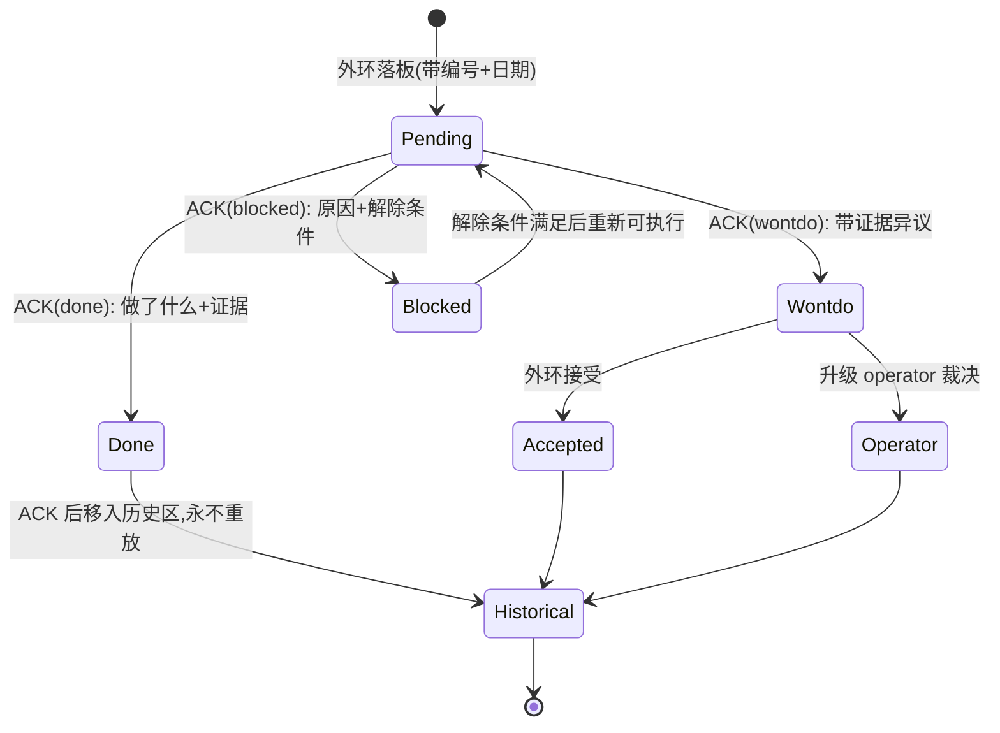
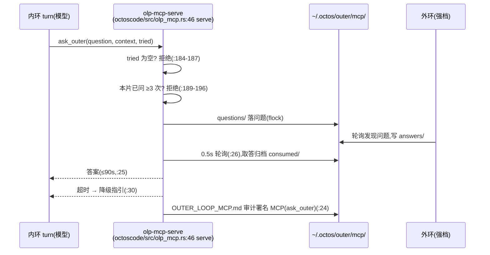
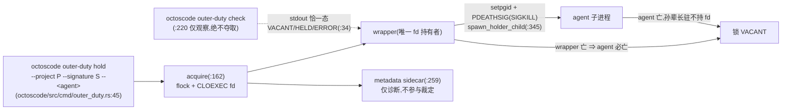

# 第 20 章:OctoLoop:外环协议 OLP v2

> **定位**:本章分析 v2 新增的外环协议 OLP(OctoLoop)的全部载体:30 个文件,其中协议文档 7 件(`octoscode/docs/OUTER_LOOP_PROTOCOL.md` 403 行等)、workspace 脚手架 2 件、Rust 源码 9 件(`octoscode/src/olp_mcp.rs` 406、`octoscode/src/outer_duty.rs` 476 等)、契约测试 3 件(25 个用例)、脚本与技能 5 件、octos 主仓交叉面 4 件。核心论点只有一个:这套协议的大部分内容没有运行时实现,它是「协议条款 + Markdown 约定 + 契约测试」三层的叠加,少数有代码的部分(第五信道、主审权锁)恰好是没法靠文档钉住的部分。前置依赖:第 18 章(goal/peer 的服务端机制,本章只从外环视角观测它们)。适用场景:想让一个外部强模型长期监督、指导、验收另一群便宜模型干活的系统搭建者。

## 20.1 双环模型:贵模型只花在判断上

OctoLoop 把一个长程任务拆给两圈 agent 加一个人,三者的模型档位刻意错开。`octoscode/docs/OUTER_LOOP_PROTOCOL.md:19` 的角色表:operator(人)负责宏观指令与终审;runtime(octos serve + master/peers)负责长程执行,跑在便宜档车道上;outer agent(本协议的对象,Claude Code、Codex 或任意脚本化 agent)负责计划、事件驱动监控、交付审查与指导,跑在强档。设计动机写在 `octoscode/docs/OCTOLOOP_GUIDE.md:248`:内环便宜、可反复重跑,出错成本低;外环贵,只花在判断上,每个 commit 过两双眼睛,推送权只在外环手里。协议与具体模型无关:换一个外环 CLI 或换一批内环车道,协议不变。

双环不共享内存,一切协作走可审计的持久信道。下行(outer → runtime)五条:`AGENTS.md` 常驻约束(每个 session boot 时由 prompt layer 自动注入)、黑板任务级指导、原子 git commit 即既成事实、inbox 门铃(阅后即焚,只放事件通知与黑板指针)、herdr TUI 注入(文本落在 composer 即用户消息层级,等价 operator 亲手输入)。上行(runtime → outer)六条:serve 日志事件流、`peers/<slug>/result.md` 交付物、`goal-ledgers/<goal_id>` 权威账本、escalation 求助、git log/diff、以及方向相反的主动问询,即后文的第五信道。完整矩阵在 `octoscode/docs/OUTER_LOOP_PROTOCOL.md:27`(下行 `:29`、上行 `:39`)。

```mermaid
flowchart TB
    OP["operator(人)<br/>宏观指令 / 终审 / 审批"]
    subgraph OUTER["outer agent(强档)"]
        PLAN["计划 / 监控 / 审查 / 指导"]
    end
    subgraph INNER["runtime(octos serve + master/peers,便宜档)"]
        KEEPER["goal keeper"]
        PEERS["peers 并行干活"]
    end
    BB[("&nbsp;.octos/OUTER_LOOP_REVIEW.md&nbsp;")<br/>黑板:权威账本]
    MCP["~/.octos/outer/mcp/<br/>第五信道信箱"]
    OP -->|"/goal 指令"| OUTER
    OP -->|"审批 / 终审"| OUTER
    OUTER -- "下行①AGENTS.md ②黑板 ③commit ④门铃 ⑤TUI 注入" --> INNER
    INNER -- "上行①事件流 ②result.md ③ledger ④escalation ⑤ask_outer ⑥git diff" --> OUTER
    OUTER <--> BB
    INNER <--> MCP <.-> OUTER
```

观测本身分三层,这是外环最容易误判的地方。`octoscode/docs/OLP_OUTER_BOOT.md:60` 的规则:投递(notes 文件被清空)不等于消费(turn prompt 读到)不等于执行(交付/ACK 落地),只看一层必误判。实战记录里的两个「读而不执行」事故直接促成了门铃模式定型:inbox 只放指针,内容一律去黑板取。

本章用三层视角读这 30 个载体:协议条款层(角色、信道、R 规则,纯文档)、Markdown 约定层(黑板、ACK、loop.md,无任何 Rust 实现)、契约测试层(三个测试文件 25 个用例,唯一的机械强制)。少数机制跨层存在:ACK 是条款加契约,主审锁是条款加实现加契约。

## 20.2 R1–R7:七条纪律与它们各自的教训

协议语义核心是七条规则,`octoscode/docs/OUTER_LOOP_PROTOCOL.md:52-103`。每条规则背后都有一次真实事故,协议文档把事故与规则写在同一份文件里,这是它与其他「先写规范后补实现」文档最大的区别。

**R1 ACK 义务**(`:52`)。黑板 Active 区的每条意见,runtime 执行后必须在条目下补一行 ACK,无 ACK 视为未读,外环有权打回交付。v1 起 ACK 行用定式语法 `ACK(done|wontdo|blocked): <说明>`,三态各有语义:done 写做了什么与证据(commit hash 或测试结果);wontdo 是带证据的异议,分歧规则限定外环对 wontdo 只能接受或升级 operator,不得对同一条目再次打回;blocked 写阻塞原因与解除条件。案例:2026-08-23 的 v0 实验(`:196` 起)黑板十条评审项全部带 ACK 收口,其中第 9 条内环以证据拒绝重派指令(ACK wontdo),外环复核后接受,事后证明内环是对的。这一条是纯条款加契约:语法由 `octoscode/tests/olp_contract.rs:96` 的 `olp_ack_lines_match_v1_grammar` 钉住,豁免边界由 `:120` 的 `olp_ack_exemption_is_bounded_whitelist`(v1 语法只约束 2026-08-24 起新增的 ACK 行,历史行不重写)与 `:159` 的 `olp_ack_rejects_unknown_status` 钉住。

**R2 诚实验证声明**(`:67`)。每个交付必须声明 verified(跑过 `cargo test --all-targets` + clippy + fmt)、partially-verified(列出实际跑了什么)、unverified(说明原因)三档之一;声称 verified 但复验不符视为协议违例。案例来自 v0 实验与后续性能战役(`:218` 起)的两类反例:其一,peer 在沙箱里声明「本机无工具链」,真相是权限档 1-4 的 bwrap 沙箱不挂载 `~/.cargo` 与 `~/.rustup`,任何构建命令都 command not found;其二,测试全绿不等于真机正确,快照机制单测全过但对存量大账本零收益,writer 超时重驱动的内存 duplex 测试全过但真管道字节流损坏。R2 的实战增补因此写成:凡涉 IO/并发,外环终审要求真 OS 原语复验(真管道、真文件),内存替身只配当冒烟。

**R3 升级分级**(`:71`)。escalation 三级:runtime 自决(重试换法)、outer 裁决(技术取舍、批不批方案)、operator 裁决(权限审批、范围变更、对外动作)。外环不得代替 operator 按下审批;operator 缺席时 escalation 保持 park。案例:v0 实验第 10 条,新依赖 signal-hook 走了升级请求;更重要的是裁决审计面(`:322` 起),goal 模式下 master 不会为「自认为解决了」的事再问外环,历史样本里 goal_03 测量方法错误,master 与 peer 均无自觉、零上报,外环审文档才抓住,所以外环必须主动审计 ledger 的 decisions/escalations 表。

**R4 工作区共存**(`:74`)。同一工作区多写者各自只 `git add` 自己改的文件,禁止 `git add -A`;改动即原子 commit;来源不明的 dirty 文件保留并报告,不得自动清理。案例:性能战役里外环在共享工作区做探针实验,与内环修复混编译断、diff-preview 竞态 SIGBUS,此后定型为外环诊断一律用独立 git worktree。

**R4b 树主权与自动围栏**(`:77`)。多 goal 撞同一棵树时,主工作树只属一个 goal:自动围栏谓词(active goal 大于 1、peer 目标分支与主树分支不一致、主树有未围栏在途 peer)命中即自动开 worktree;树主权第一个落非默认分支的 goal 持久化进 goal-ledger,重启恢复;不属 owner goal 的会话在主树做跨分支 checkout 一律拒绝并提示开围栏。这条把防撞从「外环 steer 盯着」降级为系统默认机制,外环只在谓词未覆盖的边界补位(octos #20-20c 移交,作为 R4 子条款,不升协议版本)。

**R5 指导幂等**(`:89`)。外环意见带日期与唯一编号,只在 Active 区可执行;ACK 后移入历史区永不重放,重复投递以 ACK 为去重依据。这条直接回应 inbox 阅后即焚曾吞掉指导的已知局限(`:345`):R 系列规则一律不依赖 inbox。

**R6 版本协商**(`:103`)。协议文档头部声明 `protocol: olp/v2`(`octoscode/docs/OUTER_LOOP_PROTOCOL.md:7`),`octoscode/AGENTS.md:3` 引用同版本,信道语义变更必须升版本。双处一致由 `octoscode/tests/olp_contract.rs:215` 的 `olp_version_consistent_across_docs` 钉住,这是六条规则里唯一有机械验证兜底的版本纪律。

**R7 主审权 OS 独占锁**(`:91`,olp/v2 起,#38-r1)。多外环并存时主审权以 per-project 会话寿命 OS 锁为准,详见 20.5 节。条款本身就写明范围:Linux-only,单机 flock + PDEATHSIG + /proc,NFS 不适用,Windows LockFileEx 另立条目。

条款之外,协议文档还固化了多外环协作规则:黑板批注一律带署名(无署名视为历史兼容的默认外环);每个进行中条目只有一个主审外环,他人只能留署名意见;两外环意见相左时不在黑板上互相打回,各自写署名意见升级 operator(`:260` 起)。v1 到 v2 的变更记录在 `:12-15`,附录 A 固化 result.md frontmatter v1 六字段(`:354`),附录 B 固化 sub_providers 车道模板与双环搭配矩阵(`:375`/`:393`):分析与验证走 cheap 车道,实施与 keeper 留主档,理由是前者的产出被外层审查兜底,后者的产出直接进主线与账本。

## 20.3 黑板与 ACK:没有运行时的协议核心

黑板是 OLP 最核心也最容易被误解的机制。必须先说清它是什么:一块每仓库一个的 Markdown 文件(`<repo>/.octos/OUTER_LOOP_REVIEW.md`),Active 区放带编号的审查条目,Historical 区放已 ACK 的历史。它没有 Rust 实现,没有数据库,没有服务进程。追加写 入的唯一正道是 `octoscode/scripts/olp-board-append.sh`(24 行),核心就三行:`exec 9>"$LOCK"`(`:20`)打开锁文件、`flock -x 9`(`:21`)互斥、整条目一次性 `cat >> "$BOARD"`(`:22`)落板,条目正文从 stdin 喂入。flock 保证多外环并发追加不撕裂;一次性 append 保证条目原子可见。

内环侧的对应物是 `.octos/loop.md` 维护循环契约:读黑板 Active 区、取编号最小未 ACK 条目执行到完成、只 commit 不 push、补 `ACK(done|wontdo|blocked)` 定式。本书仓库自己的这块循环契约只有 13 行(octos-book/.octos/loop.md),外环审查黑板 465 行、29 个编号条目、71 处 ACK 行。这本书的 v2 重写就是按这套协议驱动的:外环把每章的整改意见编号落板,内环按号执行并 ACK,主审复验后代推。黑板内容本身不进入本章,机制已经足够说明问题。

ACK 三态构成一个小状态机:条目发出后处于 pending,内环执行后落 ACK 进入 done、wontdo 或 blocked 终态;wontdo 分支外环只能接受或升级 operator,不存在再次打回的边。这个状态机的全部强制力量来自契约测试:`octoscode/tests/olp_contract.rs`(367 行,8 个用例)对签入的黑板快照做 grep 型校验,`olp_ack_lines_match_v1_grammar`(`:96`)校验 ACK 行符合 v1 定式,豁免白名单(`:120`)把生效日期分界写死,未知 status 拒绝(`:159`)。换句话说,协议违约不会被运行时拦截,只会在下一次跑测试时变成红灯。



R5 的幂等语义依赖 ACK 行做去重键:同一编号再投递,已有 ACK 即跳过。这解释了为什么 ACK 必须是定式语法而说明部分自由文本非空即可:机器只 grep 状态词与编号,不解析自然语言。

这层约定的价值要在事故里看。协议文档的已知局限一节(`octoscode/docs/OUTER_LOOP_PROTOCOL.md:345`)记录了 inbox notes 阅后即焚曾实测吞掉指导,所以 R 系列一律不依赖它;日志按进程启动日期滚动而非自然日,tail 要同时跟两天的文件;session-hash 用 DefaultHasher 跨 Rust 版本不保证稳定,外环不得用它持久寻址。三个局限全部指向同一个设计结论:凡是会被静默丢掉的信道,都不能承载协议义务;义务只落在黑板、git 与 ledger 这三个重启幸存的载体上。

## 20.4 第五信道:内环在 turn 内反向外呼

前四条上行信道(事件流、result.md、ledger、escalation)与第 6 条代码信道都是「外环拉取」模型:内环留下痕迹,外环循事件来读。第五信道方向相反,内环主动推。它是 OLP 里少数有完整 Rust 实现的机制:`octoscode/src/olp_mcp.rs`(406 行,纯标准库,#31 起 Python 原型归档 `octoscode/scripts/reference/`)暴露恰好两个 MCP 工具(`tools_schema` 在 `:328`):`ask_outer(question, context, tried)`(`:174`)与 `report_blocked`(`:255`)。

三个防滥用的参数都写死在常量里。`ASK_TIMEOUT_SECS = 90.0`(`octoscode/src/olp_mcp.rs:25`):turn 内同步发问,超时返回 `DEGRADED_GUIDANCE`(`:30`)降级指引而非卡死 turn,轮询间隔 `ASK_POLL_INTERVAL_SECS = 0.5`(`:26`)。`ASK_QUOTA_PER_SLICE = 3`(`:27`):每切片最多问三次,超出返回 `QUOTA_REFUSAL`(`:31`),防思考外包。tried 必填:空 tried 直接拒绝(`:184-187` 返回 `TRIED_REFUSAL`,`:32`),模型必须先写自己试过什么才有资格问。传输走信箱目录 `~/.octos/outer/mcp/`(`outer_root` 在 `:36`,`OLP_MCP_OUTER_ROOT` 可覆盖)下的 questions、answers、consumed 三级流转,取答后归档 consumed,全程审计落 `OUTER_LOOP_MCP.md`(`BOARD_RELATIVE` 在 `:28`),署名固定 `MCP(ask_outer)`(`SIGNATURE` 在 `:24`)。



挂载方式是内环 profile(`~/.octos/profiles/<id>.json`)的 `config.mcp_servers`:`command` 指向 octoscode 二进制,`args` 为 `["olp-mcp-serve"]`。协议文档接入清单(`octoscode/docs/OUTER_LOOP_PROTOCOL.md:131-137`)记录了三个实测坑:配置落点是 profiles 下的 JSON 而非 instances 的 config.toml(后者无人加载);profile JSON 时间戳必须 RFC3339 带 Z,缺时区解析全挂;工具注册表在会话建立时快照,改配置或换二进制后必须新建会话才见新工具。CLI 接线在 `octoscode/src/cmd/olp_mcp.rs:6`(`OLP_MCP_TIMEOUT_SECS` 环境变量可覆盖默认超时,`:8-10`),子命令注册在 `octoscode/src/cmd/mod.rs:28`。行为契约由 `octoscode/tests/olp_mcp_contract.rs`(290 行,7 个用例,真实子进程 stdio)钉住:握手(`:98`)、恰好两工具(`:115`)、往返(`:144`)、超时降级(`:209`)、限额拒绝(`:227`)、tried 必填(`:246`)、report_blocked 只落板(`:266`)。

## 20.5 主审权锁:Linux-only 的诚实收缩

多外环并存的最大风险是双头指令:单外环的注入都会落后一个 turn,两个外环必然打架。olp/v2 的答案是 R7 主审权锁,实现是 `octoscode/src/outer_duty.rs`(476 行)。模块第一条编译期声明就是 `#![cfg(target_os = "linux")]`(`:23`):整个模块在 macOS 上不编译,非 Linux 平台的 CLI 显式 unsupported 退出。代码注释把这称为 honest shrink,与其在 macOS 上假装锁存在,不如诚实地不可用。

锁的设计密度值得逐符号读。`DutyState`(`:34`)三态枚举 Vacant/Held/Error,`as_str`(`:43`)输出单行机器可读的 `VACANT`/`HELD`/`ERROR`,契约明确 Error 绝不伪装成 VACANT,坏输入宁可报错也不让调用方误判可上岗。锁文件路径 `~/.octos/outer/duty/<sha256>.lock`(`lock_path` 在 `:63`,HOME 缺失 fail-closed),摘要用 `lock_digest`(`:83`)算 SHA-256,域前缀 `LOCK_DOMAIN = "octoscode/outer-duty/v1"`(`:55`);注释明确不用 DefaultHasher,因为它跨 Rust 版本不稳定(`octoscode/docs/OUTER_LOOP_PROTOCOL.md:349` 的已知局限同源)。`DutyHold`(`:99`)让 fd 即锁:唯一持有者,CLOEXEC 保持置位不外泄。`acquire`(`:162`)flock 持锁并收紧文件权限;`check`(`:220`)仅观察、绝不夺取。metadata sidecar(`write_metadata`/`read_metadata` 在 `:259`/`:311`)与一切 TTL 只作诊断,绝不参与裁定,防止「锁还在但旁路数据说它过期」的裁决分裂。

死亡耦合是这条锁的灵魂:`spawn_holder_child`(`:345`)用 setpgid 加 `PR_SET_PDEATHSIG(SIGKILL)` 把 agent 与 wrapper 绑死,并处理 fork 与 prctl 之间的竞态(`:345-380`)。wrapper 是唯一锁 fd 持有者,wrapper 亡则 agent 必亡,锁即 VACANT,不存在 agent 活着而锁显示空闲的脑裂;反过来 agent 退出而孙辈进程长驻,锁同样归 VACANT,孙辈不持有 fd。活锁接管只归 operator:终止旧 holder 后再 acquire,无 agent 自助强夺。



十条契约测试(`octoscode/tests/outer_duty_contract.rs`,745 行)把这个不变量集钉死:两个竞争者恰一个赢(`:174`)、wrapper 亡杀 agent 并释放(`:288`)、孙辈长驻仍 VACANT(`:371`)、check 不惊扰持有者(`:446`)、metadata 损坏不影响所有权(`:475`)、权限收紧(`:526`)、坏输入永不 VACANT(`:579`)、敌意 metadata 下 stdout 仍单行(`:605`)、digest 黄金值收敛(`:650`)、建目录失败即 Error(`:709`)。接线一致性(协议、boot 文档、技能三面)由 `octoscode/tests/olp_contract.rs:303` 与 `:329` 两个用例守护。

平台边界不藏着:`octoscode/docs/OCTOLOOP_GUIDE.md:221` 的矩阵写明 Linux 全功率(`:227`),macOS 两缺口(`:229`),其一就是 outer-duty 不可用,多外环协作退回值班簿纪律层加 operator 裁决;值班簿在任何平台都只是提示性目录,不构成所有权。macOS 的进程收割(reaper)方案已立项,需求文件在 octoscode 仓 `knowledge/requirements/req-olp-duty-macos.md`。当前切片的 fencing 只到文档层纪律,写入面校验 lease 的硬 gate 是后续条目。

## 20.6 octos 侧落点:预算与四个观测 CLI

协议文本大部分落在 octoscode 仓,但外环真正要观测和驱动的对象在 octos 主仓。交叉面四个 CLI 加一个预算落点。`crates/octos-cli/src/commands/steer.rs:1` 头注释自证身份:`octos steer — external reviewer steer channel (OLP P2, slice 1)`,`STEER_MAX_BYTES`(`:22`)限 64KB,超限入队即拒,走 `.reviewer-notes` sidecar、user-message 层级而非系统指令。`crates/octos-cli/src/commands/ledger.rs:1` 头注释同样自证:`octos ledger tail — read-only goal-ledger tail (OLP L1, slice 4)`,外环用它审计 master 的 decisions 与 escalations 表(R3 的裁决审计面)。`crates/octos-cli/src/commands/peer.rs` 的 `list_peers`(`:54`)与 `crates/octos-cli/src/commands/goal.rs` 的 `GoalStatusArgs`(`:340`)构成 L1 只读观测三件套。

goal 预算是约定与实现的组合:外环在任务书里按档位给条目定预算(修订 5-10M、切片 10-20M、战役 30-50M token,`octoscode/docs/OLP_OUTER_BOOT.md:34`),octos 侧的落点在 `crates/octos-cli/src/autonomy/goal_loop_runtime.rs`:`GoalRuntimeState`(`:265`)的五态里 budget_limited 是独立中间态而非失败,预算耗尽触发 `GoalBudgetResolution`(`:298`)走 GoalWrapUp 收口(`crates/octos-cli/src/autonomy/master_continuation_scheduler.rs:147`)。这些机制的内部实现属于第 18 章的范围,本章只强调外环视角的一个后果:预算耗尽不是事故,是有名字、可恢复的现场,外环回线后按账本收账即可。

协议还固化了驱动机制选型(`octoscode/docs/OUTER_LOOP_PROTOCOL.md:289` 起):外环在线盯着交互式攻坚时直驱 master,herdr 注入 user-message,切片化后每片一个 turn,比 handoff 到 peer 再 gather 少两跳;外环离线的长程任务用 /goal 承载,keeper 跨 turn 自动推进,escalation 走 goal 账本 durable 兜底。两种形态共用黑板与 ACK 契约层,选型只看外环在不在线。

> **工程决策:为什么黑板是 Markdown 而不是数据库**
> 黑板的需求清单:多写者并发追加不撕裂、条目可编号可去重、历史可审计、git 可版本化、任何 agent 不装依赖就能读写。Markdown 文件加 flock 追加脚本满足全部五条,而且第 18 章的 `GoalLedger`(`crates/octos-fleet/src/sqlite_ledger.rs:13`,6,360 行)已经证明结构化账本要付出多大工程代价:39 个公开方法、WAL 多进程并发、状态机嵌进 SQL。黑板的消费者是外环强模型,它能读自然语言,不需要查询计划;需要的机械性质只有追加原子性与 grep 可校验性,前者 24 行 shell 脚本(`octoscode/scripts/olp-board-append.sh:20-22`)解决,后者由 `octoscode/tests/olp_contract.rs:96` 的快照 grep 解决。把黑板做成数据库,等于为一个每天几十次写入、消费方只有一个模型读者的文件,引入一个需要迁移、需要备份、git 看不见 diff 的存储层。协议文档把这层取舍隐含在设计里:结构化的事实(目标状态、发现、升级)进 ledger,叙述性的判断(审查意见、异议、裁决)留在黑板,两类数据各走各的存储。

## 20.7 边界与回顾

与第 18 章的边界:goal 与 peer 的服务端机制(GoalLedger、keeper、续跑调度、peer 生命周期)是第 18 章的内容,本章只从外环视角取用它们的观测面(ledger tail、peer list、goal status)与预算落点;R4b 自动围栏依赖的 peer_handoff 与 worktree 机制在第 18 章讲过,本章只讲协议层语义。与第 21 章的边界:herdr 的安装、驾驶舱配置、注入通道的运维细节属下一章,本章的 herdr 只作为下行信道之一出现。与第 19 章的边界:octoscode 的 UI Protocol 与终端客户端架构已在第 19 章,本章的 octoscode 只取它的三个 OLP 载体(olp_mcp、outer_duty、协议文档)。

本章回顾:

1. OLP v2 是三层叠加:协议条款(角色、信道、R1-R7)纯文档;黑板、ACK、loop.md 是 Markdown 约定,无 Rust 实现;机械强制只有三个契约测试文件 25 个用例对快照的 grep 与真实子进程验证。
2. 黑板追加唯一正道是 `octoscode/scripts/olp-board-append.sh:20-22` 的 flock 三行;ACK 定式三态 done/wontdo/blocked,wontdo 只能被接受或升级,不得再次打回。
3. 第五信道是内环主动外呼的唯一通道:`octoscode/src/olp_mcp.rs` 恰好两个工具,90 秒超时降级(`:25`)、每片三次限额(`:27`)、tried 必填(`:184-187`)。
4. 主审权锁诚实收缩:`octoscode/src/outer_duty.rs:23` 整模块 Linux-only,fd 即锁,PDEATHSIG 死亡耦合消灭 agent 活而锁闲的脑裂,check 只观察不夺取,活锁接管归 operator;macOS 退值班簿纪律层。
5. 贵模型只花在判断上:双环的信道全部是文件、git 与 CLI,协议模型无关,换厂牌不换协议。

## 延伸阅读

- `octoscode/docs/OUTER_LOOP_PROTOCOL.md` — 协议唯一权威文本,R1-R7 条款、附录 A/B、v0 实验与两次战役的全部教训
- `octoscode/docs/OLP_OUTER_BOOT.md` — 外环上岗卡:重启硬清单、观测三层、安全红线、内环选型
- `octoscode/docs/OCTOLOOP_GUIDE.md` — 上手与机制双篇,平台支持矩阵与 goal 状态机
- `octoscode/tests/outer_duty_contract.rs` — 锁语义的十条不变量,读它比读文档更快理解设计意图

## 思考题

1. ACK 定式只 grep 状态词,不解析说明文本。如果内环在说明里写「已执行但测试没跑」却标 done,现有的契约测试能拦住吗?要让 R2 验证级别进入 ACK 行,语法与豁免边界要怎么改才不破坏历史条目?
2. `ASK_QUOTA_PER_SLICE = 3` 的「片」是 turn 还是任务书里的切片?如果按 turn 计数,一个长任务跨多个 turn,内环最多能问多少次?这个限额防的是什么形态的滥用,为什么 90 秒超时降级比无限等待更安全?
3. `lock_digest` 放弃 DefaultHasher 改用 SHA-256,理由是跨 Rust 版本不稳定。假设锁文件因为升级 Rust 而全部失配,现场会发生什么:旧 holder 还活着但新 check 算出的路径不同?如何用 `duty_lock_digest_golden_and_convergence` 的思路防止这类事故?
4. 把黑板换成 SQLite 需要哪些额外机制才能保住现在的五条性质(并发追加、编号去重、历史审计、git 版本化、零依赖读写)?逐条估算工程量,再判断值不值。
5. macOS 上没有 outer-duty 锁,多外环靠值班簿纪律层共存。设计一个不改 Rust 代码的 flock 等价方案(shell 脚本即可),并说明它为什么达不到 PDEATHSIG 死亡耦合的保证。

---

> **版本演化说明**:本章分析基于 octos 主仓 main @ 9c157101、octoscode main @ 1129fa33、herdr feat/octoscode-agent @ fefe5c4f(2026-09-03 取基准,行号与常量逐条复核自 `assets/ch20-facts.md` 及其生成命令)。OLP v2 于 2026-08-30 生效(#38-r1 新增 R7);v1 的 ACK 定式与 frontmatter v1 六字段自 2026-08-24 生效。协议演进以 `octoscode/docs/OUTER_LOOP_PROTOCOL.md:7` 的版本头与 `octoscode/AGENTS.md:3` 的引用为权威,双处一致性由 `octoscode/tests/olp_contract.rs:215` 守护;硬 gate(写入面校验 lease)与 macOS reaper(`knowledge/requirements/req-olp-duty-macos.md`)为在途条目,落地后本章 20.5 节需更新。
