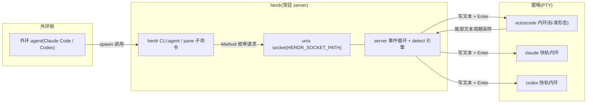
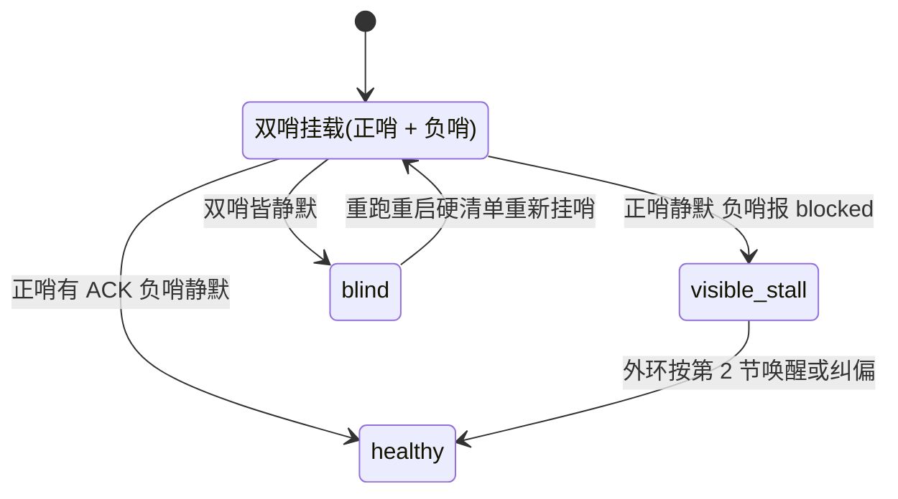

# 第 21 章:herdr 与外环运维实务

> **定位**:本章讲 herdr,外环的驾驶舱:一个后台常驻的终端工作区服务,内环窗格住在它里面,外环通过 CLI 与 socket API 发现、注入、观测它们。识别契约、三原语、上岗与重启清单、双哨配方、平台坑与降级,在这一章汇成一份可执行的运维手册。前置依赖:第 19 章(octoscode 客户端,识别文案的来源)、第 20 章(OLP 协议条款)。适用场景:要搭建或运维双环系统、编写 agent 驱动终端的工具链,或评估「让 agent 操作终端」这条路线的工程师。

## 21.1 驾驶舱:终端住在服务里

前两章把双环的两端讲完了:第 19 章的 octoscode 是内环的终端客户端,第 20 章的 OLP v2 是外环的行为契约。中间还缺一件东西。外环自己是一个 agent 进程,没有眼睛也没有键盘,它怎么看到内环窗格里的画面,怎么把一段提示敲进内环的输入框?答案是给终端配一个服务端,让终端从「进程的附属品」变成「服务的住户」。

herdr 的 README 把自己定义为 the runtime your coding agents live on(`herdr/README.md:29`)。这个定义拆开是四句承诺(`herdr/README.md:31` 至 `herdr/README.md:34`):

1. always running:herdr 是后台 server,终端住在里面。合盖、断网、重启机器,agent 继续干活,会话可恢复,从任意终端或 ssh 重新 attach;
2. never hunt for the stuck one:每个窗格都被标记 working / blocked / idle,agent 停下来等人回答时,herdr 直接标出来,不用逐个翻找;
3. agent-native:agent 通过 CLI 与 socket API 驱动 herdr,开窗格、互相 prompt、等另一个 agent 真正 blocked;
4. runs what you already run:不包装、不替换 claude code、codex、cursor、opencode、grok 等工具,只拥有它们的终端。

第 4 句对本书最重要。herdr 不理解 octos 的 goal、账本、黑板,它只做终端宿主;对 agent 的全部「理解」收敛为两个问题:这个窗格里跑的是什么?它现在什么状态?这两个问题的答案分别住在 detect 模块与一份 40 行的识别清单里,是本章后两节的主角。键盘与鼠标是双一等公民(`herdr/README.md:35`),整个程序是 one rust binary, no electron(`herdr/README.md:37`),源码构建用 `cargo build --release`,单测 `just test`,维护检查 `just check`(`herdr/README.md:71` 起的 development 一节)。

体量先立在这里:herdr 的 `src/` 共 245 个 `.rs` 文件、229,696 行;顶层 37 个文件 29,927 行;最大的子目录是 `app`(54 个文件 65,400 行,其中 `herdr/src/app/mod.rs` 6,606 行、`herdr/src/app/actions.rs` 6,155 行、`herdr/src/app/api.rs` 2,303 行),其后是 `server`(16 个文件 19,166 行,含无头模式的 `herdr/src/server/headless.rs`)、`ui`(17 个文件 12,416 行)、`pane`(9 个文件 10,540 行)、`integration`(13 个文件 9,822 行)、`api`(22 个文件 8,957 行)。与外环打交道的 CLI 层反而薄:`herdr/src/cli/agent.rs` 949 行,`herdr/src/cli/pane.rs` 2,108 行。薄的原因是 CLI 不做业务,只做参数解析与转发:每个子命令函数把参数装进 schema 类型,经 `send_request`(`herdr/src/cli.rs:762`)发到 unix socket,等 server 回话。

拓扑如图:



socket 的寻址有一套降级链:`active_api_socket_path`(`herdr/src/session.rs:173`)优先读环境变量 `HERDR_SOCKET_PATH`(常量定义在 `herdr/src/api/mod.rs:31`),没设则按会话名推导 `<config_dir>/sessions/<name>/herdr.sock`(`api_socket_path_for`,`herdr/src/session.rs:169`);config 目录尊重 `XDG_CONFIG_HOME`(`herdr/src/config/io.rs:30`)。这条链解释了多实例共存的机制:每个会话一个 socket,外环脚本只要能定位会话名就能定位通道。thin client 模式另有专用的 `herdr-client.sock`(`client_socket_path_for`,`herdr/src/session.rs:183`),客户端模块的自我描述是 connects to the server's client socket(`herdr/src/client/mod.rs:1`)。

server 内部的事件流通读一下模块首行就能拼出图景:后台任务不直接碰 UI,而是把事件经 channel 交给主循环(`herdr/src/events.rs:1`,internal app events delivered via channel);事件枚举 `AppEvent` 定义在 `herdr/src/events.rs:56`,与外环相关的四个变体是 `PaneDied`(`:58`)、`AgentProcessDetected`(`:60`)、`StateChanged`(`:66`)、`HookStateReported`(`:76`)。窗格排布由 BSP 树负责(`herdr/src/layout.rs:1`,BSP tree layout for tiling panes),无头模式把事件循环跑在无真实终端的环境里(`herdr/src/server/headless.rs:1`)。把这几个模块串起来看,`herdr pane read` 返回的屏幕、`agent list` 返回的状态、`agent wait` 的达成信号,背后都是同一条事件总线:`StateChanged` 由 detect 引擎的裁决触发,wait 族(21.3 节)订阅它来判定等待何时完成。

与相邻两章的边界在这里划清:第 19 章讲被观测对象 octoscode 本体,本章只消费它的屏幕文案;第 20 章讲协议条款(R1 至 R7、ACK 语法、黑板、主审锁),本章不复述条款,只讲这些条款靠 herdr 落地执行时的操作面。herdr 的插件系统与远程 ssh 场景不在本章范围。

## 21.2 识别契约:从屏幕反推状态

herdr 对 agent 的认知全部来自屏幕。detect 模块的文档写得直白(`herdr/src/detect/mod.rs:1`):每个窗格的活动缓冲区尾部文本被周期性读取,与已知 agent 的输出模式匹配,得出状态。状态机是四态的 `AgentState`(`herdr/src/detect/mod.rs:13`):`Idle`(:15)、`Working`(:17)、`Blocked`(:18)、`Unknown`(:19)。前三个对应 README 的承诺,第四个留给普通 shell 与未识别程序。

识别的目标程序枚举在 `Agent` 里,共 24 个(`Agent::ALL`,`herdr/src/detect/mod.rs:71` 起),octoscode 是其中之一:`Agent::Octoscode`(`herdr/src/detect/mod.rs:67`)。注意版本事实:这个变体只存在于 herdr 的 `feat/octoscode-agent` 分支(本章基线 `fefe5c4f`,提交标题就是 feat(detect): add octoscode as a supported agent),上游 master 尚未合入。走屏幕 manifest 匹配的 agent 共 22 个(`SCREEN_MANIFEST_AGENTS`,`herdr/src/detect/mod.rs:96`,`Self::Octoscode` 在 :118),每个 manifest 是一份内嵌的 TOML,在 `herdr/src/detect/manifest.rs:256` 以 `("octoscode", include_str!("manifests/octoscode.toml"))` 编进二进制。标签与可执行名各有映射:`agent_label` 把变体渲染成 octoscode(`herdr/src/detect/mod.rs:144`,`:149`),`interactive_agent_executable` 返回启动可执行名(`:153`,`:184`),`parse_agent_label` 反向解析标签,octoscode 与别名 octos-tui 都指向同一变体(`herdr/src/detect/mod.rs:207`,`:225`)。

manifest 的引入还解决了一个工程问题:识别规则本质上是数据,不是代码。每支持一个新 agent,不需要改 detect 引擎,只需要加一份 TOML、在名单里挂一次枚举变体。规则本身带版本号(octoscode 这份是 2026.08.23.1)与 min_engine_version(1),manifest 更新模块(`herdr/src/detect/manifest_update.rs`)可以独立于引擎演进。对本书读者更相关的是另一面:识别规则住在被识别方的对端,octoscode 团队改一次状态栏文案,herdr 侧(以及任何做同样事情的工具)就要跟着改规则,这份耦合没有任何编译期保护,唯一的守护是冒烟清单里的那一步 `herdr agent list`。

octoscode 的识别契约全文 40 行(`herdr/src/detect/manifests/octoscode.toml`),头 5 行是清单元数据,正文三条规则:

```toml
id = "octoscode"
version = "2026.08.23.1"
min_engine_version = 1
updated_at = "2026-08-23T00:00:00Z"
aliases = ["octos-tui"]

[[rules]]
id = "approval_blocked"
state = "blocked"
priority = 1100
region = "whole_recent"
visible_blocker = true
any = [
  { contains = ["Approval | y once | s session | n deny"] },
  { contains = ["Waiting on you"] },
  { contains = ["Ctrl+R/Alt+A answer"] },
  { contains = ["审批 | y 本次 | s 本会话"] },
]

[[rules]]
id = "statusbar_working"
state = "working"
priority = 1000
region = "bottom_non_empty_lines(6)"
visible_working = true
any = [
  { line_regex = ['state\s*[·,]\s*Working'] },
  { contains = ["Esc interrupt"] },
]

[[rules]]
id = "statusbar_idle"
state = "idle"
priority = 900
region = "bottom_non_empty_lines(6)"
any = [
  { line_regex = ['state\s*[·✓,⚠]*\s*(Idle|Done)'] },
  { contains = ["Tab agents | Ctrl+O expand"] },
  { contains = ["Ask Octos to change code"] },
]
```

三条规则的结构值得逐项拆。id 是规则的稳定标识;state 是命中后写入窗格的状态;priority 决定多规则同时命中时的仲裁,blocked 的 1100 压过 working 的 1000 与 idle 的 900,这符合直觉:等待审批的画面比状态栏更紧急;region 限定匹配范围,blocked 规则看 whole_recent(整个近期缓冲,因为审批框可能出现在任何位置),两条状态栏规则只看 bottom_non_empty_lines(6)(底部 6 条非空行,状态栏的家);`any` 数组是或语义,任一子句命中即成立。三个布尔里有两个是仲裁信号:`visible_blocker` 与 `visible_working` 声明「屏幕上真的看得见这个状态」,它们参与 detect 内部的来源仲裁(`AgentDetection` 结构,`herdr/src/detect/mod.rs:25` 起),屏幕证据可以覆盖集成上报的非 blocked 状态。

为什么 octoscode 的识别可以这么薄?第 19 章给过答案:哑客户端架构让屏幕文案忠实反映服务端状态,状态栏既是给人看的界面,也是机器的观测接口。同一串 Working 文案,人眼读出「在干活」,herdr 的正则读出 state=working。这份契约的维护责任也随之清楚:octoscode 侧任何状态栏改版,都必须同步这份 manifest,否则外环的眼睛立刻失明。快速验证手册依赖的正是它:冒烟一节要求 `herdr agent list` 显示 `octoscode | <pane> | idle`(`octoscode/docs/OLP_QUICKSTART.md:151`),这个 idle 就是 `statusbar_idle` 规则命中的结果,规则失配时冒烟第一步就过不去。

## 21.3 外环三原语:发现、注入、观测

CLI 的分发结构很短。总入口 `maybe_run`(`herdr/src/cli.rs:95`)按第一个参数路由,`"agent"` 在 `herdr/src/cli.rs:125`,`"pane"` 在 `herdr/src/cli.rs:127`。`run_agent_command`(`herdr/src/cli/agent.rs:12`)再分发 11 个子命令:list、get、read、send-keys、prompt、rename、focus、wait、attach、start、explain(`:19` 至 `:29`);`run_pane_command`(`herdr/src/cli/pane.rs:12`)分发 list、get、read、split、send-keys、wait-output、run 等。外环的日常全部落在其中三五个命令上,可以归纳为三个原语。

**发现**:`herdr agent list`,实现是 `agent_list`(`herdr/src/cli/agent.rs:438`,usage 行 `:440`),发 `Method::AgentList`(`herdr/src/api/schema.rs:107`)。返回每个窗格的 agent 标签、窗格号与状态。外环上岗第一件事就是跑它,把「哪个窗格是我的内环」这个问题变成一行输出。

**注入**:`herdr agent prompt <target> <text> [--wait] [--until STATUS]... [--timeout MS]`,实现是 `agent_prompt`(`herdr/src/cli/agent.rs:771`,usage 行 `:774`)。`--until` 与 `--timeout` 必须配 `--wait` 使用(`:825`、`:828` 各有一道检查),请求经 `Method::AgentPrompt`(`herdr/src/api/schema.rs:127`)进 server,参数类型 `AgentPromptParams` 只有三个字段:target、text、可选的 wait 选项(`herdr/src/api/schema/agents.rs:176`,字段在 `:178` 至 `:180`)。

**观测**:`herdr pane read <pane_id> [--source visible|recent|recent-unwrapped|detection] [--lines N] ...`,实现是 `pane_read`(`herdr/src/cli/pane.rs:455`,USAGE 常量 `:473`),走 `Method::PaneRead`(`herdr/src/api/schema.rs:175`)。`--source detection` 直接返回 detect 引擎的裁决,是排查识别失灵的第一现场。

三原语之外还有三个配角。`herdr pane split ... --direction right|down --cwd PATH`(`pane_split`,`herdr/src/cli/pane.rs:623`,usage `:733`)开新窗格,函数头还会读 `HERDR_PANE_ID` 环境变量(`:624`),让运行在窗格里的程序能以自己为锚分屏。`herdr pane run <pane_id> <command>`(`pane_run`,`herdr/src/cli/pane.rs:1047`,usage `:1049`)在窗格里执行命令,实现朴素得近乎透明:把命令文本与一个 Enter 键打包成 `Method::PaneSendInput` 发下去(`:1050` 至 `:1056`)。`herdr agent wait <target> [--until STATUS]... [--timeout MS]`(`agent_wait`,`herdr/src/cli/agent.rs:506`,usage `:508`)阻塞到状态达成,server 侧由 `wait_for_agent`(`herdr/src/api/wait.rs:132`)实现;同族还有 `wait_for_output`(`:22`)、`prompt_agent`(`:177`)与 `wait_for_event`(`:661`)。

一次注入的完整时序如下,重点在 server 侧的四道门:

```mermaid
sequenceDiagram
    participant O as 外环 agent
    participant C as herdr CLI
    participant S as herdr server
    participant T as 内环终端(octoscode)

    O->>C: herdr agent prompt <pane> '<text>' --wait --until idle
    C->>S: agent.prompt(AgentPromptParams)
    S->>S: 门1 空文本 → empty_agent_prompt
    S->>S: 门2 blocked → agent_blocked(要求交互输入)
    S->>S: 门3 未识别或启动未就绪 → agent_not_ready
    S->>S: 门4 前台进程名匹配失败 → agent_not_ready
    alt 四门全过
        S->>T: 写入文本(按终端模式编码)
        S-->>T: 300ms 后补发 Enter
        T-->>S: 状态栏变化,detect 命中新状态
        S-->>C: AgentPrompted;wait_for_agent 达成
        C-->>O: 成功返回
    else 任一门拒绝
        S-->>C: 对应错误码
        C-->>O: 非零退出
    end
```

四道门是 `handle_agent_prompt`(`herdr/src/app/api/agents.rs:62`)按序执行的:空文本拒绝(`:63` 至 `:65`,错误码 empty_agent_prompt);目标窗格 blocked 时拒绝(`:81` 至 `:89`,错误码 agent_blocked,理由是要交互输入而不是新任务);agent 未识别或托管启动未就绪返回 agent_not_ready(`:95` 至 `:98`);第四道最值得展开:`runtime_hosts_agent` 校验窗格前台进程名(`herdr/src/app/api/agents.rs:105` 至 `:112`),不符则报 agent is no longer the pane foreground process。这个函数在 `herdr/src/app/agents.rs:421`,实现是取窗格子进程的前台作业(`foreground_job`),识别其中的 agent,与期望比对。第四道门就是外环文档里「注入静默丢失」双重门的第二重:第一重是窗格必须在 named-agent 名单里(known agent),第二重是此刻前台进程必须就是那个 agent(`octoscode/docs/OLP_QUICKSTART.md:162`)。缺一即丢,而且丢得安静。

四门全过后,写入分两步:先按终端模式编码文本写入,再延时 300 毫秒补发 Enter(`AGENT_PROMPT_SUBMIT_DELAY` 常量在 `herdr/src/app/api/agents.rs:13`,使用在 `:126`)。延时的理由是给 TUI 一拍时间把文本吃进输入框,立即回车可能抢在渲染前。Copilot 有个特例可以反证这套机制的材质:它聚焦丢失后会忽略合成 Enter,所以 herdr 在给它注入前要先发一个 focus gained 事件再写文本(`herdr/src/app/api/agents.rs:112` 起)。octoscode 不需要这步,但这个特例说明 herdr 的注入通道对 TUI 的具体行为有细粒度适配,适配的开关就在 server 侧按 agent 分派。

> **工程决策:注入为什么走 TUI 用户消息层级,而不是给 octoscode 开一个 API**
> 第 19 章的结论在这里兑现:octoscode 是哑客户端,本来就没有「接收外部文本」的服务端 API,它的输入框是唯一公共入口。herdr 若为 octos 特制 API,就得理解 session、游标、重放这一整层,违背 runs what you already run 的承诺;走 TUI 输入框,则对 claude、codex、octoscode 一视同仁,herdr 对 agent 的认知永远止步于屏幕。对照另一条下行通道更清楚:`octos steer` 也把外环文本作为独立 user 消息注入,但它面向 session、经 serve 内部通道(`octoscode/docs/OLP_OUTER_BOOT.md` 第 2 节),适合内环 turn 进行中插话;herdr prompt 面向窗格、走屏幕,适合内环空闲时唤醒。同是用户消息层级,方向与时机不同,两者互补而不是替代。代价也要写明:这条通道依赖识别契约的文案稳定,还要过双重门,任何一环漂移,注入就从「成功」变成「静默」。

状态值在两层的集合不同,排查时容易踩空。CLI 与 API 层的 `AgentStatus`(`herdr/src/api/schema/common.rs:151`)是五态:idle、working、blocked、done、unknown(`:152` 至 `:156`),CLI 解析函数同样收五个值(`herdr/src/cli.rs:897`,分支在 `:899` 至 `:903`);detect 层的 `AgentState` 只有四态,没有 done。pane 上报侧的解析 `parse_pane_agent_state`(`herdr/src/cli.rs:910` 至 `:915`)也只收四态。用 `--until done` 等一个 detect 层根本不产生的状态,等到的一定是超时。

## 21.4 从三原语到运维:上岗、重启与内环开设

三原语只是零件,OLP 文档把它们组装成清单。外环上岗卡(`octoscode/docs/OLP_OUTER_BOOT.md`)的开篇原则先记住:环境细节会漂移,窗格号、实例哈希、会话键都不要硬编码,清单教的是发现方法。

上岗清单(综合 `octoscode/docs/OLP_QUICKSTART.md` 第 1、2 节与 `OLP_OUTER_BOOT.md` 第 0 节):

1. 依赖体检:herdr 是「否,推荐」级依赖(`octoscode/docs/OLP_QUICKSTART.md:35`),不装可退化为 tmux send-keys;要用 octoscode 窗格识别,当前需从 `feat/octoscode-agent` 分支构建;
2. 项目目录跑 olp-init 脚手架,生成 `.octos/loop.md` 与黑板模板;
3. serve 起步永远是 operator 亲手执行,免沙箱授权是信任决策,不外包给 agent;
4. `/loop resume` 由外环代办:先 `/loop list` 取 id,再带 id resume,裸 resume 会被拒;
5. 双哨挂载(下一节展开);
6. fallbacks 配置核对,且确认新会话已快照:改配置不重启只是纸面保险。

内环重启后的巡检是一份四步硬清单(`octoscode/docs/OLP_OUTER_BOOT.md` 第 0b 节,`:16` 至 `:32`),禁止「记一笔稍后补」:第一步 serve 起,operator 亲手;第二步 `/loop resume` 外环必代;第三步双哨挂载;第四步 fallbacks 与新会话快照核对。清单背后有一次实打实的事故:维护心跳 paused 一整天无人察觉,直到夜间主道断供、goal 熔断、哨盲区三层同时失守才暴露,停摆 8 小时。教训被写进清单本身:主机制健康时,兜底层的瘫痪完全不可见,兜底的健康只能靠巡检,不能靠事故。

内环的开设是 agent 无关的。内环契约只有四条(`octoscode/.octos/loop.md:5` 起):读黑板 Active 区,执行编号最小的未 ACK 条目,只 commit 不 push,完成后落 ACK(done|wontdo|blocked) 定式。任何能读文件、跑命令、被 herdr 驱动的 agent 都能当内环。三种形态按需选(`octoscode/docs/OLP_OUTER_BOOT.md` 第 6 节):octoscode 加便宜模型是标准形态,goal、peer、ledger、steer、事件流全套机械都有;Claude Code 免审批窗格质量高,适合快轨难切片;codex 窗格与主审厂牌隔离,利于互审。开设动作就是 `herdr pane run`:

```bash
# 标准形态:octoscode 挂 octos serve
herdr pane run <pane> 'cd <repo> && octoscode --stdio-command "octos serve --stdio --solo --danger-full-access"'
# 快轨形态:claude 免审批(operator 亲手执行)
herdr pane run <pane> 'cd <repo> && claude --dangerously-skip-permissions'
```

开设后发内环上岗词,内容指向 `loop.md` 与黑板 Active 区。此后内环的维护循环完全由 herdr 注入的 prompt 触发:一次 prompt 就是一轮「读板、取单、执行、落 ACK」。外环不轮询内环内部状态,只在外环自己需要推进时叫醒它。

唤醒与纠偏的分工(`octoscode/docs/OLP_OUTER_BOOT.md` 第 2 节,`:47` 至 `:58`):内环空闲时用 `herdr agent prompt` 唤醒,一句话指向黑板新条目编号;内环正在跑 turn 时改用 `octos steer` 插话,不打断动作,下一拍被消费。steer 按 cwd 找实例,必须在项目目录下执行,会话键从 `ls <repo>/.octos/octos/sessions/` 的文件名 URL 解码得到。用哪个通道的判据只有一个:看 `herdr agent list` 报的状态。

## 21.5 侦听哨配方:三层观测与双哨

观测上行有三层,缺一不可(`octoscode/docs/OLP_OUTER_BOOT.md` 第 3 节,`:60` 至 `:72`):第一层现场屏幕,`herdr pane read <pane>`;第二层事件流,`tail -f .../data/events.jsonl`,看 steer_consumed、escalation、goal_transition 等事件;第三层结构面,`octos goal status` 与 `octos peer list`。文档的口吻来自教训:投递不等于消费,消费不等于执行,只看一层必误判。三层分别回答三个问题:屏幕说「它现在长什么样」,事件流说「协议上发生了什么」,结构面说「goal 与 peer 的账对不对」。

双哨是重启硬清单的第三步:正信号哨盯 ACK 落板,负信号哨盯 events.jsonl 里的 `goal_transition blocked` 与 escalation。只挂正哨时,goal 熔断的沉默与「还在干活」不可区分;负哨补的正是这块盲区。双哨的状态空间:



三个状态里最危险的是双哨皆静默:内环可能只是没事做,也可能整条观测链断了,而后者从外环看与前者毫无差别。把它与三层观测合起来用是唯一解:哨静默时去读第三层结构面,`octos goal status` 会告诉你 goal 是 active 还是早就 blocked,`octos peer list` 会告诉你派出去的 worker 还在不在。把这套配方写进重启硬清单的第三步,是让「兜底瘫痪不可见」这堂 8 小时课不再重上的最省力手段。

## 21.6 常见坑与降级

运维章节最后留给坑。第一个坑就是 21.3 节的第四道门:注入静默丢失。症状是 `herdr agent prompt` 发出去了,内环毫无反应,命令却未必报错。原因两重:窗格不在 named-agent 名单,或前台进程名与期望 agent 不符(`octoscode/docs/OLP_QUICKSTART.md:162`)。典型时序是内环刚好在跑一个 shell 命令,前台进程瞬时是 bash 而不是 octoscode,注入恰落在窗口里。修法两层:重试前先 `herdr agent list` 确认状态;确认环境没有 herdr 或门持续拒绝时,降级 tmux send-keys,首字符为 `-` 的文本用 `--` 分隔。降级要清醒:send-keys 只是无门控的裸键入,双重门、状态等待、`--until` 语义全部丢失,等于从驾驶舱退回遥控器。

第二个坑是平台差异:OLP 的主审权锁(outer-duty)依赖 flock 与 PDEATHSIG,是 Linux-only,macOS 上不编译,多外环并存退回值班簿纪律层(第 20 章已展开,`octoscode/docs/OLP_OUTER_BOOT.md` 第 3.5 节)。这不是 herdr 的缺陷,而是整条工具链的平台边界:在 mac 上跑双环,主审互斥靠约定不靠锁。

第三个坑在安装侧:首启自动下载 octos server 失败,多半是离线或代理问题,手装 `npm i -g @octos-org/octos`,设 `OCTOSCODE_NO_AUTO_INSTALL=1` 关自动安装(`octoscode/docs/OLP_QUICKSTART.md` 第 6 节故障表)。同表还有一条 Linux 专属:构建大项目时链接器 SIGBUS 或 EDQUOT,是 tmpfs 配额问题,把 TMPDIR 指到 home 盘。第四个坑是版本:octoscode 识别在 fork 分支,`--kind octoscode` 用了上游 master 构建的 herdr 会静默不识别,窗格状态永远是 unknown,冒烟那步 `octoscode | <pane> | idle` 过不去,顺着这条症状反查最快。

排查这些坑时,`herdr agent explain`(`herdr/src/cli/agent.rs:41`,usage `:91`)与 `pane read --source detection` 是两件趁手工具:前者解释窗格为什么被判成当前状态,后者直接给出 detect 引擎的原始裁决,把「识别错了」与「画面真的变了」区分开。CLI 的完整入口表可以随时用 `herdr agent help` 打印,帮助总表硬编码在 `print_agent_help`(`herdr/src/cli/agent.rs:922`,正文 `:923` 至 `:941`);报错信息也带路:任何一个子命令参数敲错,usage 字符串原样回显(usage 行与源码逐字一致,本章引用的 usage 全部来自事实表的 sed 抽查),照着改就行。

## 21.7 边界与回顾

与第 19 章:octoscode 的状态栏文案是识别契约的源头,客户端架构决定了屏幕可观测;本章只消费这份契约,不再重复客户端内部机制。与第 20 章:黑板、ACK、R1 至 R7、主审锁的条款语义全在那章,本章只讲操作面,即这些条款靠哪几条 herdr 命令落地。与第 18 章:goal 与 peer 的服务端机制不在本章,观测只用到 `octos goal status` 与 `octos peer list` 两个只读命令。

回顾本章脉络:herdr 是终端宿主而非 agent 框架,对 agent 的认知收敛为 detect 引擎加一份 manifest;外环三原语(发现、注入、观测)映射到 `agent list`、`agent prompt`、`pane read` 三个 CLI 子命令,server 侧四道门决定注入的成败;上岗、重启、双哨、三形态内环把零件组装成可执行的运维手册;静默丢失与平台差异是这套实务里最贵的两份学费。双环的完整图景至此闭合:内环的一切状态在协议与屏幕里(第 19 章),外环的一切行为在条款里(第 20 章),连接两者的手是 herdr(本章)。

## 延伸阅读

- `herdr/README.md` — 定位承诺与开发流程的原始表述
- `herdr/src/detect/mod.rs` — detect 引擎:AgentState、Agent 枚举、manifest 装配
- `herdr/src/detect/manifests/octoscode.toml` — 本章识别契约全文,40 行
- `octoscode/docs/OLP_OUTER_BOOT.md` — 外环上岗卡:重启硬清单、三层观测、内环开设
- `octoscode/docs/OLP_QUICKSTART.md` — 依赖清单、冒烟验证、故障速查表
- `assets/ch21-facts.md` — 本章全部数字与行号的事实来源,逐条附复跑命令

## 思考题

1. 若 octoscode 一次改版把状态栏文案从 `state·Working` 改为 `state: Working`,按本章的链路推演,哪些环节会在什么时刻失配?给出一份让文案与 manifest 不漂移的工程方案。
2. 双重门的第二重(前台进程名匹配)为什么要存在?设想没有它的攻击或事故场景:一个恶意或故障的 shell 循环输出伪状态栏,能否骗过只有第一重门的系统?
3. `AgentStatus` 有 done 而 `AgentState` 没有。查 herdr 源码找出 done 从哪来(集成上报还是屏幕推断),并论述两层状态集合不一致的设计代价。
4. tmux send-keys 降级丢掉了哪三样东西?若要给降级通道补一个最小可用的心跳验证,你会复用本章哪个原语?
5. 双哨皆静默的盲区状态,单靠外环自身无法与「内环空闲」区分。若允许你在内环侧加一个低成本的周期信号,加在哪一层(屏幕、事件流、结构面)最便宜且最难被伪造?

---

> **版本演化说明**
> 本章为 v2 新增章,分析基线:herdr `feat/octoscode-agent` @ `fefe5c4f`(版本 0.8.2,2026-08-29)、octos main @ `9c157101`(2026-09-02)。全部行数、行号与 usage 字符串取自 `assets/ch21-facts.md`(2026-09-03)并经作者在上述基线复跑核对;octoscode 文档引用标注相对路径。octoscode 的窗格识别(`Agent::Octoscode` 与 `herdr/src/detect/manifests/octoscode.toml`)当前仅在 fork 分支,合入上游 master 后应以 master 为准。herdr 迭代较快,CLI usage 与 manifest 规则可能随版本调整,引用时以符号名与规则 id 为锚。
