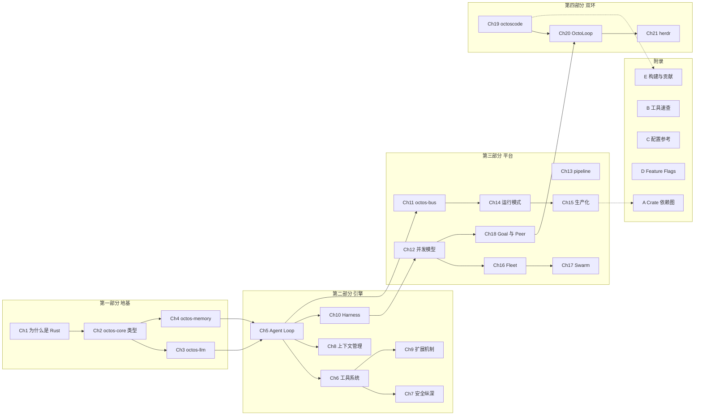

# 前言

## 为什么写这本书

AI Agent 正在从演示走向生产。但多数 Agent 框架的源码读起来像一组脚本：字符串拼接的 prompt、宽松的错误处理、随进程重启即消失的状态。做原型时这不碍事；一旦你要求 Agent 长驻运行、执行 Shell 与文件操作、同时服务多个租户，缺的就不是某个功能，而是操作系统级别的基础设施：权限边界、并发调度、可恢复的执行账本、可审计的协议。

octos 是一个用 Rust 构建的 AI Agent 操作系统。本书写作基线为主分支约 70 万行 Rust 源码、26 个 crate 的工作区，workspace 级 `deny(unsafe_code)`。它不是某种语言重写的调用链封装，而是从第一行代码起就为多租户隔离、生产可靠性、可扩展并发设计的系统：Provider 容错链自带凭据轮换与断路器（详见第 3 章），沙箱与权限走 fail-closed（详见第 7 章），长程任务有事件账本与续跑调度（详见第 12 章）。

第二版把全书从 14 章扩展到 21 章，并新增第四部分「双环」：外环（一个监督用的强模型与运维面）如何驱动内环（干活的一群模型）。octoscode 终端客户端、OctoLoop 外环协议 OLP v2、herdr 运维工具三章合起来回答一个问题——当便宜模型在内环干活时，谁来验收、谁在出错时接管。

这本书不是用户手册。它是一本工程决策解析：每章深入一个子系统，展示为什么这样设计、考虑过哪些替代方案、付出了什么代价。所有论断都给出源码引用，读者可以逐条到仓库里核对。

## 阅读准备

### 前置知识

- 必备：熟练使用一门主流编程语言（Python、Go、Java、C++ 皆可），能读懂代码，了解 HTTP 与 JSON。
- 有帮助但不强制：Rust 基础语法。第 2 章会用到 trait 与枚举，第 12 章会用到 async/await。不熟 Rust 的读者不必却步：第 1-2 章特意放慢节奏，语言相关的细节在侧栏与注释里就地解释，跳过不影响主线。
- 有帮助但不强制：LLM API 的基本概念（token、上下文窗口、工具调用）。没调用过 LLM API 也能读：第 3 章从 Provider 抽象讲起，概念随用随定义。
- 不需要：机器学习数学、模型训练经验、编译器原理、操作系统内核开发经验。

### 推荐阅读路径

路径 A：Rust 初学者（借一个真实的大型项目入门 Rust 与 Agent 工程）
> Ch1 → Ch2 → Ch5 → Ch6 → 选读
> 先在 Ch1 理解为什么选 Rust，Ch2 看类型系统如何定义领域语言，Ch5 跟完一次对话的完整生命周期，Ch6 读工具派发。之后按兴趣选读：Ch8（上下文压缩）、Ch12（并发模型）都是好去处。给自己留出适应借用检查器的前两周。

路径 B：资深 Rust 开发者（关心大型 Rust 系统的架构与并发实现）
> Ch1 → Ch3 → Ch12 → 深入
> Ch1 的 workspace 拓扑与选型论证是全书的地图；Ch3 看 trait object 在 Provider 抽象上的取舍；Ch12 的三层并发调度（Tokio 层、supervisor 层、peer/lease 层）是本书并发叙事的核心。之后按方向深入：安全看 Ch7 与 Ch10，平台看 Ch14 与 Ch15，多 agent 内核看 Ch16-18。

路径 C：AI 应用开发者（从会调 API 到理解运行时内部）
> Ch1 → Ch5 → Ch6 → Ch14 → Ch19 → Ch20 → Ch21
> Ch5-6 回答「我发的消息到底经历了什么」，Ch14 讲清运行模式与配置后，直接进入双环部分：octoscode 客户端（Ch19）、外环协议 OLP v2（Ch20）、herdr 运维实务（Ch21）。跳过实现细节侧栏不影响理解。

路径 D：octos 贡献者（要给仓库提第一个 PR）
> 全书按序 + 附录 A 与附录 E
> 附录 A 的 26 crate 依赖图（63 条边）帮你定位改动影响面，附录 E 给出从源码构建与贡献流程。第 10 章的契约测试与事件 ABI 是多数 PR 绕不开的接口。

### 全书知识地图

两个阅读提示。其一，Ch5（Agent Loop）是全书枢纽：前四章是它的地基，第 6-10 章是它的展开，第 12、16、18 章的执行内核都以它为基准变体。其二，第三部分内部有两条线：Ch11-15 讲平台基础设施（消息、并发、工作流、配置、生产化），Ch16-18 讲多 agent 内核（Fleet、Swarm、Goal/Peer）；第四部分（Ch19-21）站在外环视角回看全书，第 20 章依赖第 18 章的服务端机制。

### 阅读标记说明

- 源码引用：全路径加行号，如 `crates/octos-agent/src/agent/execution.rs:2483`，可在源码仓库直接定位。仓库持续演进，行号会漂移，因此正文同时给出符号名（函数、类型、常量）；行号对不上时以符号名为锚。
- 三层标注体系（第 20 章引入）：描述一个机制时标注它由哪一层强制——协议条款（纯文档）、Markdown 约定（黑板、ACK 等无运行时代码的约定）、契约测试（对快照或真实子进程的机械校验）。这一区分最初用于外环协议 OLP v2，回读第三、四部分时同样适用：知道「谁在强制这条规则」才能判断违约时会发生什么。
- 工程决策侧栏：每章一个引用块（`>` 开头），比较 2-3 种替代方案的利弊，说明最终取舍的代价。
- 版本演化说明：每章末尾交代该子系统的机制如何随版本变化，帮助读者对照手头版本的差异。
- 章首定位：每章开头的一段引用块，写明本章前置依赖与适用读者，可据此快速判断是否跳读。
- Mermaid 图：架构图、状态机、时序图穿插正文，均可在支持 Mermaid 的阅读器中渲染。
- 思考题：每章末 3-4 道开放式问题，适合团队讨论或自测。

### 本书基准

版本基线：octos 主仓 main @ `9c157101`（2026-09-02 统计）、octoscode @ `1129fa33`、herdr `feat/octoscode-agent` 分支 @ `fefe5c4f`。全书规模与行号数字（26 crate、约 70 万行 Rust、63 条依赖边、各模块行数）取自各章事实表（`assets/chNN-facts.md`），逐条附复现命令，可在对应基线上核对。第 19-21 章涉及的三个仓库迭代很快，行号漂移属正常现象，引用以符号名为准。

---

愿这本书帮你建立的不只是对 octos 的理解，还有一套评估 Agent 基础设施的尺子：安全边界在哪、谁在强制协议、状态能否恢复、错误去了哪里。带着这四问去读任何 Agent 系统，都会有收获。
